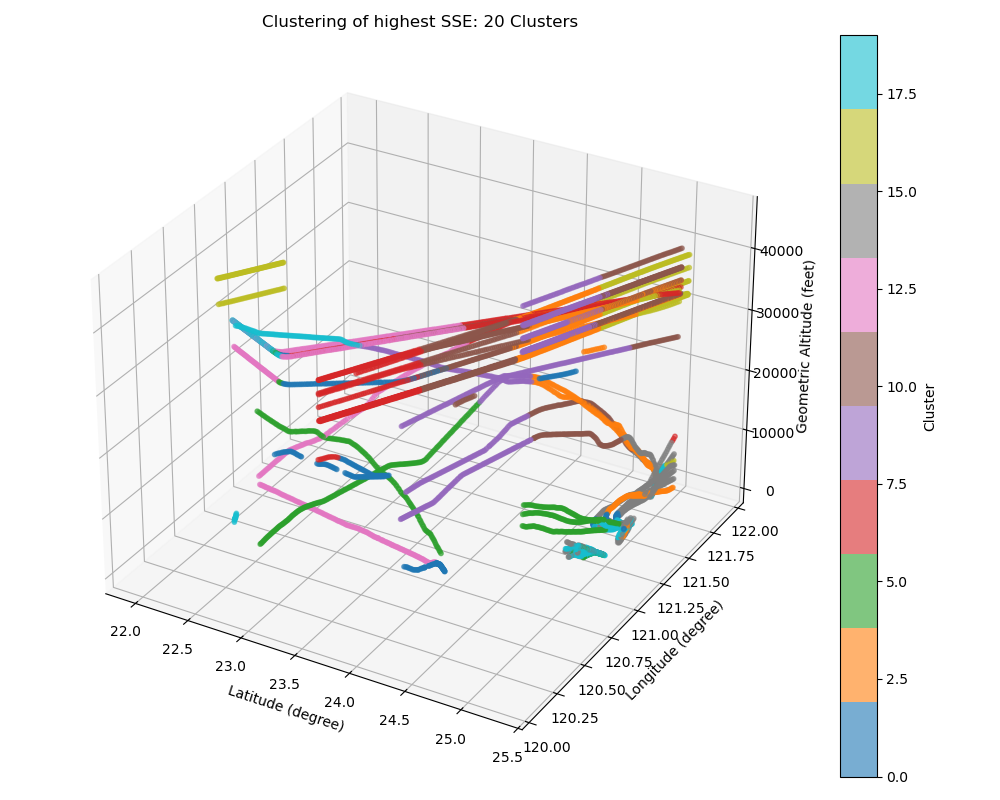
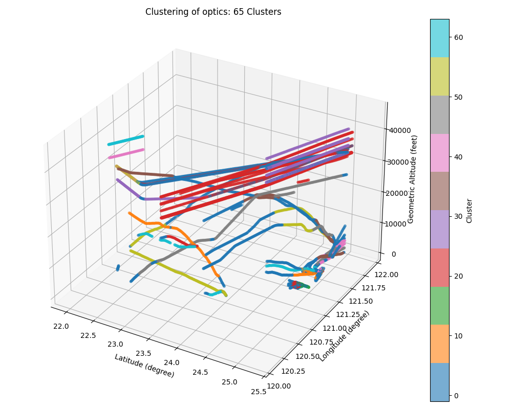
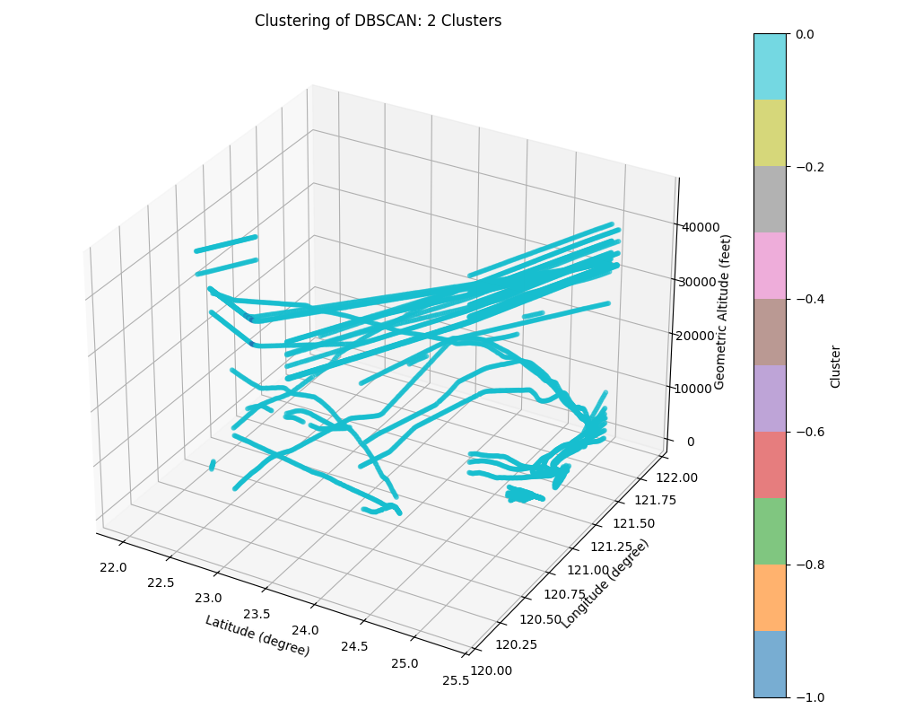
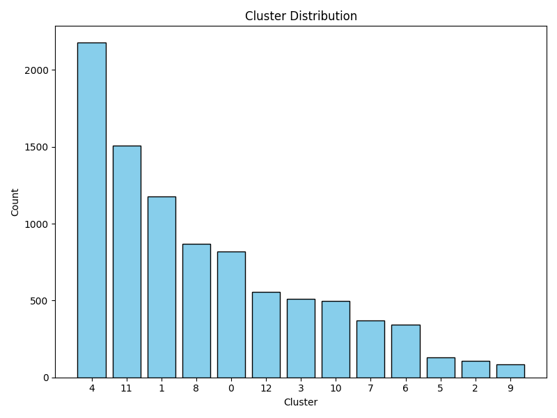
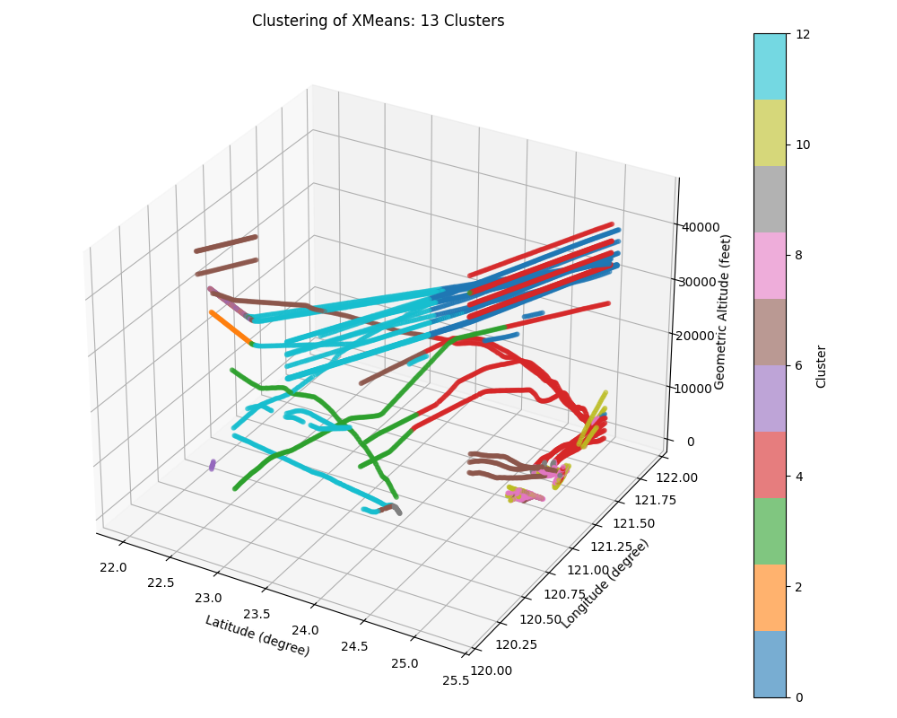
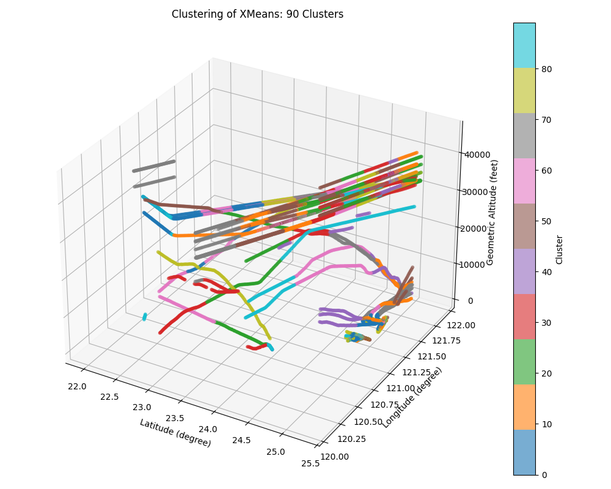

# Experiments
## Dataset
- Dataset: ```./data./preprocessed./readsb-hist_filtered_by_Taiwan_manual_edges.csv```
- Because the dataset is small, so finetuning minPoint is crucial.
- Used attributes:
    ```
    gs
    track
    squawk
    nav_heading
    ecef_x
    ecef_y
    ecef_z
    ```
## File naming
- ```clustered.arff```: the output file after using Weka.
- ```clustered.csv```: the output file after clustered, only has one column ```cluster```, ```-1``` means noise, else means the serial number of the cluster.
- ```clustered.html```: the visualized map page that scatter each row in data, colored by the cluster number. The color of noise must be gray, else chosen randomly. The color will not repeat.
- ```3D.png```: the 3D (```lat```, ```lon```, ```alt_geom```) visualized graph that colored by cluster number.
- ```distribution.csv```: the distribution of the number of each cluster.
- ```distribution.png```: the bar chart of ```distribution.csv```.
## Clustering
### Python
#### Run
```
python cluster.py
```
#### Methods
1. [K-Means](https://scikit-learn.org/stable/modules/generated/sklearn.cluster.KMeans.html)
    - I try the 3 combination ranges of ```min_clusters``` and ```max_clusters```:
        1. ```min_clusters``` = 2, ```max_clusters``` = 40
        2. ```min_clusters``` = 2, ```max_clusters``` = 125
        3. ```min_clusters``` = 7, ```max_clusters``` = 20
    - The hyperparameters settings:
        ```random_state``` = 0, ```n_init``` = 10
    - I run each ```k``` for ```k``` in [```min_clusters```, ```max_clusters```]
    - And use 2 methods to evaluate and store the clustering by best score of each methods:
        1. Elbow method - SSE (Sum of the Squared Errors), store the clustering with lowest SSE
        2. Silhouette analysis - Silhouette Score, store the clustering with the highest Silhouette Score
    - Results:
        1. ```min_clusters``` = 2, ```max_clusters``` = 40
            - Evaluation
                
            - SSE: 40 clusters (0 ~ 39)
                
                
            - Silhouette Score: 38 clusters (0 ~ 37)
                
                
        2. ```min_clusters``` = 2, ```max_clusters``` = 125
            - Evaluation
                
            - SSE: 125 clusters (0 ~ 124)
                
                
            - Silhouette Score: 75 clusters (0 ~ 74)
                
                
        3. ```min_clusters``` = 7, ```max_clusters``` = 20
            - Evaluation
                
            - SSE: 20 clusters (0 ~ 19)
                
                
            - Silhouette Score: 18 clusters (0 ~ 17)
                
                
2. [HDBSCAN](https://scikit-learn.org/stable/modules/generated/sklearn.cluster.HDBSCAN.html) and [OPTICS](https://scikit-learn.org/stable/modules/generated/sklearn.cluster.OPTICS.html)
    - Fine-tuned records and get the "ideal hyperparameters":
        1. The definition of the "ideal hyperparameters":
            - Inputs and outputs
                > **Function** `get_ideal_hyperparameters(records_df, data_num, noise_weight, min_points_weight, clusters_weight)`  
                > &nbsp;&nbsp;&nbsp;&nbsp;**Input:**  
                > &nbsp;&nbsp;&nbsp;&nbsp;&nbsp;&nbsp;&nbsp;&nbsp;- `records_df`: DataFrame containing clustering results  
                > &nbsp;&nbsp;&nbsp;&nbsp;&nbsp;&nbsp;&nbsp;&nbsp;- `data_num`: total number of samples  
                > &nbsp;&nbsp;&nbsp;&nbsp;&nbsp;&nbsp;&nbsp;&nbsp;- `noise_weight`: maximum allowed noise ratio (default: 7%)  
                > &nbsp;&nbsp;&nbsp;&nbsp;&nbsp;&nbsp;&nbsp;&nbsp;- `min_points_weight`: maximum allowed min_points ratio (default: 5%)  
                > &nbsp;&nbsp;&nbsp;&nbsp;&nbsp;&nbsp;&nbsp;&nbsp;- `clusters_weight`: minimum allowed cluster number ratio (default: 0.1%)  
                > &nbsp;&nbsp;&nbsp;&nbsp;**Output:**  
                > &nbsp;&nbsp;&nbsp;&nbsp;&nbsp;&nbsp;&nbsp;&nbsp;- `(ideal_min_points, ideal_epsilon)`
            - Logic
                > **let** `max_noise_num = data_num × noise_weight`  
                > **let** `max_min_points = data_num × min_points_weight`  
                > **let** `min_cluster_num = data_num × clusters_weight`  
                >  
                > **let** `ideal_df = { r ∈ records_df | r.noise_num ≤ max_noise_num ∧ r.min_points ≤ max_min_points ∧ r.clustering_num ≥ min_cluster_num }`  
                >  
                > **if** `ideal_df ≠ ∅`:  
                > &nbsp;&nbsp;&nbsp;&nbsp;**let** `highest_density = first( sort(ideal_df, by = [↓ min_points, ↑ epsilon, ↑ noise_num] ))`  
                >  
                > **else**:  
                > &nbsp;&nbsp;&nbsp;&nbsp;**let** `highest_density = first( sort(records_df, by = [↑ noise_num, ↓ min_points, ↑ epsilon] ))`  
                >  
                > **return** `(highest_density.min_points, highest_density.epsilon)`
        2. Test each combinations of the following:
            - ```min_points``` = ```10, 20, 30, 40, 50, 60, 70, 80, 90, 100```
            - ```epsilon``` = ```0.7, 0.8, 0.9, 1.0, 1.1, 1.2, 1.3, 1.4, 1.5, 1.6, 1.7, 1.8, 1.9, 2.0```
        3. Fine-tuned records:
            - Fine-tuned records:
                
                
            - OPTICS
                
                
    - After get the ideal hyperparameters of HDBSCAN and OPTICS, run the following combinations of each method:
        1. ```min_points``` = 7, ```epsilon``` = 0.07
        2. ```min_points``` = 7, ```epsilon``` = 0.1
        3. ```min_points``` = 20, ```epsilon``` = 0.07
        4. ```min_points``` = 20, ```epsilon``` = 0.1
        5. ```min_points``` = 20, ```epsilon``` = 0.6
        6. ```min_points``` = 70, ```epsilon``` = 1.1 (ideal hyperparameters of OPTICS)
        7. ```min_points``` = 90, ```epsilon``` = 1.0 (ideal hyperparameters of HDBSCAN)
    - Results:
        - HDBSCAN:
            1. ```min_points``` = 7, ```epsilon``` = 0.07: 125 clusters (noise + 0 ~ 123)
                
                
            2. ```min_points``` = 7, ```epsilon``` = 0.1: 120 clusters (noise + 0 ~ 118)
                
                
            3. ```min_points``` = 20, ```epsilon``` = 0.07: 60 clusters (noise + 0 ~ 58)
                
                
            4. ```min_points``` = 20, ```epsilon``` = 0.1: 60 clusters (noise + 0 ~ 58)
                
                
            5. ```min_points``` = 20, ```epsilon``` = 0.6: 28 clusters (noise + 0 ~ 26)
                
                
            6.  Ideal hyperparameters of OPTICS: ```min_points``` = 70, ```epsilon``` = 1.1: 11 clusters (noise + 0 ~ 9)
                
                
            7.  Ideal hyperparameters of HDBSCAN: ```min_points``` = 90, ```epsilon``` = 1.0: 9 clusters (noise + 0 ~ 7)
                
                
        - OPTICS:
            1. ```min_points``` = 7, ```epsilon``` = 0.07: 125 clusters (noise + 0 ~ 123)
                
                
            2. ```min_points``` = 7, ```epsilon``` = 0.1: 120 clusters (noise + 0 ~ 118)
                
                
            3. ```min_points``` = 20, ```epsilon``` = 0.07: 60 clusters (noise + 0 ~ 58)
                
                
            4. ```min_points``` = 20, ```epsilon``` = 0.1: 60 clusters (noise + 0 ~ 58)
                
                
            5. ```min_points``` = 20, ```epsilon``` = 0.6: 28 clusters (noise + 0 ~ 26)
                
                
            6.  Ideal hyperparameters of OPTICS: ```min_points``` = 70, ```epsilon``` = 1.1: 11 clusters (noise + 0 ~ 9)
                
                
            7.  Ideal hyperparameters of HDBSCAN: ```min_points``` = 90, ```epsilon``` = 1.0: 9 clusters (noise + 0 ~ 7)
                
                
### Weka
#### Run
- Download [Weka](https://www.weka.io/), set the hyperparameters as the following and run
- Convert and visualize the outputs:
    ```
    python eval_end_draw_weka_results.py
    ```
#### Methods:
1. [DBSCAN](https://weka.sourceforge.io/doc.stable/weka/clusterers/DBSCAN.html)
    - After fine-tuned manually, I choose 2 combinations of ```minPoints``` and ```epsilon```:
        1. ```minPoints``` = 7, ```epsilon``` = 0.07
        2. ```minPoints``` = 20, ```epsilon``` = 0.6
    - Other hyperparameters remain as the defaults
    - The result clustering will be legitimate in the following intervals:
        - 0.07 <= ```epsilon``` <= 0.6
        - 7 <= ```minPoints``` <= 20
    - So I run the following combinations:
        1. ```min_points``` = 7, ```epsilon``` = 0.07
        2. ```min_points``` = 7, ```epsilon``` = 0.1
        3. ```min_points``` = 20, ```epsilon``` = 0.07
        4. ```min_points``` = 20, ```epsilon``` = 0.1
        5. ```min_points``` = 20, ```epsilon``` = 0.6
        6. ```min_points``` = 70, ```epsilon``` = 1.1 (ideal hyperparameters of OPTICS)
        7. ```min_points``` = 90, ```epsilon``` = 1.0 (ideal hyperparameters of HDBSCAN)
    - Results:
        1. ```min_points``` = 7, ```epsilon``` = 0.07: 69 clusters (noise + 0 ~ 67)
            
            
        2. ```min_points``` = 7, ```epsilon``` = 0.1: 42 clusters (noise + 0 ~ 40)
            
            
        3. ```min_points``` = 20, ```epsilon``` = 0.07: 49 clusters (noise + 0 ~ 47)
            
            
        4. ```min_points``` = 20, ```epsilon``` = 0.1: 42 clusters (noise + 0 ~ 40)
            
            
        5. ```min_points``` = 20, ```epsilon``` = 0.6: 2 clusters (noise + 0)
            
            
        6.  Ideal hyperparameters of OPTICS: ```min_points``` = 70, ```epsilon``` = 1.1: 1 cluster (0)
            
            
        7.  Ideal hyperparameters of HDBSCAN: ```min_points``` = 90, ```epsilon``` = 1.0: 1 cluster (0)
            
            
2. [EM](https://weka.sourceforge.io/doc.dev/weka/clusterers/EM.html)
    - Based on the result of DBSCAN, I only try these 2 combinations:
        1. ```numClusters``` = 7
        2. ```numClusters``` = 20
        3. ```numClusters``` = 70
        4. ```numClusters``` = 90
    - Other hyperparameters settings:
        - ```maxIterations```: 500
        - ```seed```: 10
        - Other hyperparameters remain as the defaults
    - Results:
        1. ```numClusters``` = 7: 7 clusters (0 ~ 6)
            
            
        2. ```numClusters``` = 20: 20 clusters (0 ~ 19)
            
            
        3. ```numClusters``` = 70: 70 clusters (0 ~ 69)
            
            
        4. ```numClusters``` = 90: 90 clusters (0 ~ 89)
            
            
3. [XMeans](https://weka.sourceforge.io/doc.stable/weka/clusterers/XMeans.html)
    - Based on the previous results, I try the 3 combinations:
        1. ```minNumClusters``` = 7, ```maxNumClusters``` = 20
        1. ```minNumClusters``` = 20, ```maxNumClusters``` = 70
        1. ```minNumClusters``` = 70, ```maxNumClusters``` = 90
    - Other hyperparameters remain as the defaults
    - Results:
        1. ```minNumClusters``` = 7, ```maxNumClusters``` = 20: 13 clusters (0 ~ 12)
            
            
        2. ```minNumClusters``` = 20, ```maxNumClusters``` = 70: 37 clusters (0 ~ 36)
            
            
        3. ```minNumClusters``` = 70, ```maxNumClusters``` = 90: 90 clusters (0 ~ 89)
            
            
## Analyzing
### Run
```
python analyzer.py
```
### Methods
#### Original data
##### Traditional Geography Analysis
- Visualization by each ICAO hex code
    
- Visualization by each flight:
    
1. [KDE (Kernel Density Estimation)](https://scikit-learn.org/stable/modules/generated/sklearn.neighbors.KernelDensity.html):
    - Transform discrete aircraft positions by ICAO hex code into a continuous density surface
    - Each flight point contributes a smooth **spatial influence**
    - Reveals airspace usage patterns without requiring time data
    - Kernel: Gaussian
    - Ignore the KDE value under 1e-11
    - High KDE value: the airspace with frequent flight activities
    - Low KDE value: sparsely used for empty regions
    
2. [Getis-ord Gi\* (Hotspot Analysis)](https://pysal.org/esda/generated/esda.G_Local.html):
    - A spatial statistic used to detect **clusters of high or low values**
    - Identify statistically significant spatial hot spots (high values) and cold spots (low values)
    - The grid with ```p_value``` < 0.05 will be identified as significant
    - Based on **each feature's value and its neighbors' values** within a spatial window
    - High G-i-star value: hot spot
    - Low value: cold spot
    
##### Social Network Analysis
- Grid the data points (count aircrafts): s-t network flow
    - Node: grid
    - Edge: aircraft went through
    
1. In-Degree & Out-Degree:
    - Using **directional weighted graph**
    - In-degree: number of edges **entering** a node (the sum of entering weights)
    - Out-degree: number of edges **leaving** a node (the sum of leaving weights)
    - Measures how mush traffic flows in / out through a given location
    - Hight in-degree nodes: **entry hubs**, **arrival zones**, or **bottlenecks**
    
    - Hight out-degree nodes: **exit hubs**, **take-off zones**, or **bottlenecks**
    
2. [Betweenness Centrality](https://networkx.org/documentation/stable/reference/algorithms/generated/networkx.algorithms.centrality.betweenness_centrality.html):
    - Measures how often a node lies on the **shortest paths between other nodes**
    - Reflects the node's importance as a connector or transfer point
    - Higher values mean the node is a **critical bridge** in the network
    - Hight betweenness: **flow bottlenecks**, **heavy overflight traffic**, **strategic for routing or defense**
    
3. [Closeness](https://networkx.org/documentation/stable/reference/algorithms/generated/networkx.algorithms.centrality.closeness_centrality.html):
    - Measures how **close a node is to all other nodes** in the network
    - Defined as the **inverse of the total shortest path distance** to all others
    - Higher values mean **faster accessibility** from that node to anywhere else
    - High closeness: **well-connected region**, **control centers**, **emergency routing**, **flight coordination**
    
4. [Pagerank](https://networkx.org/documentation/stable/reference/algorithms/generated/networkx.algorithms.link_analysis.pagerank_alg.pagerank.html):
    - Measures a node's **influence** based on **incoming connections from important nodes**
    - Originally designed to rank web pages
    - Consider **both the number and quality of incoming links**
    - High PageRang: **frequently reached by important air routes**
    
5. [Community Detection - Greedy Modularity](https://networkx.org/documentation/stable/reference/algorithms/generated/networkx.algorithms.community.modularity_max.greedy_modularity_communities.html)
    - Identifies **groups of nodes that are more densely connected to each other** than to the rest of the network
    - Reveals **modular structure within a complex network**
    - Common methods: **Louvain**, **Greedy Modularity** (current used), **Label Propagation**
    - Can represent: **airport influence zones**, **regional flight control areas**
    
#### Clustered data
