# Flight-Spotter
## Overview
This is the Midterm & Final project for courses \"高等資料探勘\" (Advanced Data Mining) and \"生成式AI基礎與應用\" (The Fundementals and Applications of Generative-AI), which I took at senior second semester (2025/02/01 ~ 2025/07/31, aka 113-2), at 中原大學 (Chung Yuan Christian University, CYCU), by the professor Hsiu-Min, Chuang (莊秀敏 教授).
We split this project into the three (or four) stages:
1. Data preprocessing: fetch and filter with custom conditions from [ADS-B Exchange historical data](https://www.adsbexchange.com/products/historical-data/).
2. Analyze and Build model:
    1. About Data mining: analyze the ADS-B signals which above Taiwan Main Island.
    2. About GAI: train a model for generating future flight routes simulation.
3. Interactive system: react with user's commands.

## Current progress
- [x] Preprocessed readsb-hist data and made my own dataset "readsb-hist_2025-04-01-000000-120000" and uploaded to [huggingface](https://huggingface.co/datasets/LunaticGhoulPiano/readsb-hist_2025-04-01-000000-120000).
- [x] Use ```./data./preprocessed./readsb-hist_filtered_by_Taiwan_manual_edges.csv``` to expriment the clustering algorithms by using Weka and self-written scripts.
- [x] Visualized the results of clustered data.

## TODO
- [ ] Apply the traditional geography methods: KDE (Kernel Density Estimation) and Getis-ord G* (Hotspot Analysis); and social network analysis methods: In Degree, Betweenness Centrality, and Pagerank.
- [ ] Update flow chart.
- [ ] Add discord bot to query the cluster with adsb.lol api.
- [ ] Update Overview.

## Flow
- See ```./flow.drawio``` :
    

## Warnings
### Please install required packages first by pip
```
pip install -r requirements.txt
```
### About ```main.py```
- Currently ```main.py``` only could run on **Windows** (only knows how to get user's gps location on Windows, also don't have other platform to test).
- Please enable **Windows GPS** in settings ([official tutorial here](https://support.microsoft.com/en-us/windows/windows-location-service-and-privacy-3a8eee0a-5b0b-dc07-eede-2a5ca1c49088)).
- Sometimes ```winsdk``` may have building while installing python package.

## Structure
```
Flight-Spotter
├──.env (currently unused, to store discord bot token)
├──.gitignore
├──LICENSE
├──README.md
├──requirements.txt
├──flow.drawio
├──preprocessor.py
├──get_data.py
├──filter_and_encode.py
├──analyzer.py
├──eval_end_draw_weka_results.py
├──cluster.py
├──draw_animation_by_time.py
├──ecef.py
├──gps.py
├──visualizer.py
├──bot.py (currently unused)
├──adsb_lol.py (currently unused)
├──main.py (currently unused)
├──pics
│  ├──flow.png
│  ├──JADIZ_and_CADIZ_and_KADIZ_in_East_China_Sea.jpg
│  ├──Taiwan_ADIZ.jpg
│  ├──Taiwan_manual_edges.jpg
│  ├──degree2radian.jpg
│  ├──feet2meter.jpg
│  ├──ecef_conversion.jpg
│  ├──demo_p1.png
│  ├──demo_p2.png
│  └──demo_p3.png
├──data
│  ├──aircraft (auto-generated)
│  │  └──basic-ac-db.json
│  ├──filter_regions
│  │  ├──Taiwan_ADIZ.json
│  │  └──Taiwan_manual_edges.json
│  ├──historical_adsbex_sample (auto-generated, based on user's ENABLES settings)
│  │  └──readsb-hist
│  │     ├──2025_04_01_000000.json
│  │     ├──...
│  │     └──2025_04_01_120000.json
│  └──preprocessed (auto-generated, based on the user's choose)
│     ├──readsb-hist_merged.csv
│     ├──readsb-hist_filtered_by_Taiwan_ADIZ.csv
│     └──readsb-hist_filtered_by_Taiwan_manual_edges.csv
├──filter_region_maps (auto-generated, based on the user's choose)
│  ├──Taiwan_ADIZ.html
│  └──Taiwam_manual_edges.html
├──logs (auto-generated)
│  ├──basic_ac_db.txt
│  └──readsb-hist.txt
├──python_results
│     ├──kmeans
│     │  └──readsb-hist_filtered_by_Taiwan_manual_edges
│     │     ├──min_2_max_40
│     │     │  ├──SSE
│     │     │  │  ├──3D.png
│     │     │  │  ├──clustered.csv
│     │     │  │  ├──clustered.html
│     │     │  │  ├──distribution.csv
│     │     │  │  └──distribution.png
│     │     │  ├──Silhouette_Score
│     │     │  │  ├──3D.png
│     │     │  │  ├──clustered.csv
│     │     │  │  ├──clustered.html
│     │     │  │  ├──distribution.csv
│     │     │  │  └──distribution.png
│     │     │  ├──evaluation.csv
│     │     │  └──evaluation.png
│     │     ├──min_2_max_125
│     │     │  ├──SSE
│     │     │  │  ├──3D.png
│     │     │  │  ├──clustered.csv
│     │     │  │  ├──clustered.html
│     │     │  │  ├──distribution.csv
│     │     │  │  └──distribution.png
│     │     │  ├──Silhouette_Score
│     │     │  │  ├──3D.png
│     │     │  │  ├──clustered.csv
│     │     │  │  ├──clustered.html
│     │     │  │  ├──distribution.csv
│     │     │  │  └──distribution.png
│     │     │  ├──evaluation.csv
│     │     │  └──evaluation.png
│     │     └──min_7_max_20
│     │        ├──SSE
│     │        │  ├──3D.png
│     │        │  ├──clustered.csv
│     │        │  ├──clustered.html
│     │        │  ├──distribution.csv
│     │        │  └──distribution.png
│     │        ├──Silhouette_Score
│     │        │  ├──3D.png
│     │        │  ├──clustered.csv
│     │        │  ├──clustered.html
│     │        │  ├──distribution.csv
│     │        │  └──distribution.png
│     │        ├──evaluation.csv
│     │        └──evaluation.png
│     ├──hdbscan
│     │  └──readsb-hist_filtered_by_Taiwan_manual_edges
│     │     ├──finetune_records
│     │     │  ├──heatmap_clustering.png
│     │     │  ├──heatmap_noise.png
│     │     │  └──records.csv
│     │     ├──min_7_epsilon_0_07
│     │     │     ├──3D.png
│     │     │     ├──clustered.csv
│     │     │     ├──clustered.html
│     │     │     ├──distribution.csv
│     │     │     └──distribution.png
│     │     ├──min_7_epsilon_0_1
│     │     │     ├──3D.png
│     │     │     ├──clustered.csv
│     │     │     ├──clustered.html
│     │     │     ├──distribution.csv
│     │     │     └──distribution.png
│     │     ├──min_20_epsilon_0_07
│     │     │     ├──3D.png
│     │     │     ├──clustered.csv
│     │     │     ├──clustered.html
│     │     │     ├──distribution.csv
│     │     │     └──distribution.png
│     │     ├──min_20_epsilon_0_1
│     │     │     ├──3D.png
│     │     │     ├──clustered.csv
│     │     │     ├──clustered.html
│     │     │     ├──distribution.csv
│     │     │     └──distribution.png
│     │     ├──min_20_epsilon_0_6
│     │     │     ├──3D.png
│     │     │     ├──clustered.csv
│     │     │     ├──clustered.html
│     │     │     ├──distribution.csv
│     │     │     └──distribution.png
│     │     ├──min_70_epsilon_1_1
│     │     │     ├──3D.png
│     │     │     ├──clustered.csv
│     │     │     ├──clustered.html
│     │     │     ├──distribution.csv
│     │     │     └──distribution.png
│     │     └──min_90_epsilon_1_0
│     │           ├──3D.png
│     │           ├──clustered.csv
│     │           ├──clustered.html
│     │           ├──distribution.csv
│     │           └──distribution.png
│     └──optics
│        └──readsb-hist_filtered_by_Taiwan_manual_edges
│           ├──finetune_records
│           │  ├──heatmap_clustering.png
│           │  ├──heatmap_noise.png
│           │  └──records.csv
│           ├──min_7_epsilon_0_07
│           │     ├──3D.png
│           │     ├──clustered.csv
│           │     ├──clustered.html
│           │     ├──distribution.csv
│           │     └──distribution.png
│           ├──min_7_epsilon_0_1
│           │     ├──3D.png
│           │     ├──clustered.csv
│           │     ├──clustered.html
│           │     ├──distribution.csv
│           │     └──distribution.png
│           ├──min_20_epsilon_0_07
│           │     ├──3D.png
│           │     ├──clustered.csv
│           │     ├──clustered.html
│           │     ├──distribution.csv
│           │     └──distribution.png
│           ├──min_20_epsilon_0_1
│           │     ├──3D.png
│           │     ├──clustered.csv
│           │     ├──clustered.html
│           │     ├──distribution.csv
│           │     └──distribution.png
│           ├──min_20_epsilon_0_6
│           │     ├──3D.png
│           │     ├──clustered.csv
│           │     ├──clustered.html
│           │     ├──distribution.csv
│           │     └──distribution.png
│           ├──min_70_epsilon_1_1
│           │     ├──3D.png
│           │     ├──clustered.csv
│           │     ├──clustered.html
│           │     ├──distribution.csv
│           │     └──distribution.png
│           └──min_90_epsilon_1_0
│                 ├──3D.png
│                 ├──clustered.csv
│                 ├──clustered.html
│                 ├──distribution.csv
│                 └──distribution.png
└──weka_results
      ├──DBSCAN
      │  └──readsb-hist_filtered_by_Taiwan_manual_edges
      │     ├──min_7_epsilon_0_07
      │     │     ├──3D.png
      │     │     ├──clustered.csv
      │     │     ├──clustered.html
      │     │     ├──distribution.csv
      │     │     └──distribution.png
      │     ├──min_7_epsilon_0_1
      │     │     ├──3D.png
      │     │     ├──clustered.csv
      │     │     ├──clustered.html
      │     │     ├──distribution.csv
      │     │     └──distribution.png
      │     ├──min_20_epsilon_0_07
      │     │     ├──3D.png
      │     │     ├──clustered.csv
      │     │     ├──clustered.html
      │     │     ├──distribution.csv
      │     │     └──distribution.png
      │     ├──min_20_epsilon_0_1
      │     │     ├──3D.png
      │     │     ├──clustered.csv
      │     │     ├──clustered.html
      │     │     ├──distribution.csv
      │     │     └──distribution.png
      │     ├──min_20_epsilon_0_6
      │     │     ├──3D.png
      │     │     ├──clustered.csv
      │     │     ├──clustered.html
      │     │     ├──distribution.csv
      │     │     └──distribution.png
      │     ├──min_70_epsilon_1_1
      │     │     ├──3D.png
      │     │     ├──clustered.csv
      │     │     ├──clustered.html
      │     │     ├──distribution.csv
      │     │     └──distribution.png
      │     └──min_90_epsilon_1_0
      │           ├──3D.png
      │           ├──clustered.csv
      │           ├──clustered.html
      │           ├──distribution.csv
      │           └──distribution.png
      ├──EM
      │  └──readsb-hist_filtered_by_Taiwan_manual_edges
      │     ├──clusters_7
      │     │  ├──clustered.arff
      │     │  ├──3D.png
      │     │  ├──clustered.csv
      │     │  ├──clustered.html
      │     │  ├──distribution.csv
      │     │  └──distribution.png
      │     ├──clusters_20
      │     │  ├──clustered.arff
      │     │  ├──3D.png
      │     │  ├──clustered.csv
      │     │  ├──clustered.html
      │     │  ├──distribution.csv
      │     │  └──distribution.png
      │     ├──clusters_70
      │     │  ├──clustered.arff
      │     │  ├──3D.png
      │     │  ├──clustered.csv
      │     │  ├──clustered.html
      │     │  ├──distribution.csv
      │     │  └──distribution.png
      │     └──clusters_90
      │        ├──clustered.arff
      │        ├──3D.png
      │        ├──clustered.csv
      │        ├──clustered.html
      │        ├──distribution.csv
      │        └──distribution.png
      └──XMeans
         └──readsb-hist_filtered_by_Taiwan_manual_edges
            ├──min_7_max_20
            │  ├──clustered.arff
            │  ├──3D.png
            │  ├──clustered.csv
            │  ├──clustered.html
            │  ├──distribution.csv
            │  └──distribution.png
            ├──min_20_max_70
            │  ├──clustered.arff
            │  ├──3D.png
            │  ├──clustered.csv
            │  ├──clustered.html
            │  ├──distribution.csv
            │  └──distribution.png
            └──min_70_max_90
               ├──clustered.arff
               ├──3D.png
               ├──clustered.csv
               ├──clustered.html
               ├──distribution.csv
               └──distribution.png
```

## Datasets
In this project, we decided to use the ADSBEX-provided ```readsb-hist``` data, instead of using ```traces``` or ```hires-traces```. There are two reasons:
1. It's hard to calculate the sampling rate of ```traces``` and ```hires-traces```, but ```readsb-hist``` has steady sampling rate (60 or 5 seconds, decided by the data time).
2. It's hard to reduce the dimension of all traces of an aircraft, especially the sampling rate is not steady.
### ADS-B Exchange data
- [ADS-B Exchange free historical data](https://www.adsbexchange.com/products/historical-data/)
- [readsb official documentation](https://github.com/wiedehopf/readsb/blob/dev/README-json.md)
- Data used in this project
    - Our preprocessed data already upload to [huggingface](https://huggingface.co/datasets/LunaticGhoulPiano/readsb-hist_2025-04-01-000000-120000).
    - Time range:
        - 2025/04/01 00:00:00 ~ 12:00:00
        - Sample rate: 5 seconds per data
    - Numbers and Size:
        - ```readsb-hist_merged.csv```: 6089010 rows, 857 MB
        - ```readsb-hist_filtered_by_Taiwan_manual_edges.csv```: 9148 rows, 1.27 MB
### Region Filter files
- The \"region filter files\" are all manually generated json files, described in the following format:
```
[
    {
        "latitude": first GPS coordinate latitude,
        "longitude": first GPS coordinate longitude
    },
    {second GPS coordinate},
    {third GPS coordinate},
    ...,
    {last GPS coordinate},
    {first GPS coordinate},
]
```
Each GPS coordinate is in DMS (Degrees, Minutes, Seconds) format.
In  ```filter.py```, it will fetch those ADS-B signals with their GPS locations in the polygon surrounded by the above region filter file.
We made two region filter files:
1. ```./data./filter_regions./Taiwan_ADIZ.json```:
    - The exact GPS coordinates of Taiwan ADIZ (Air Defense Identification Zone) is described in *Part 2 - ENR 5.2.3 ADIZ*, provided by [Taiwan eAIP](https://ais.caa.gov.tw/eaip/AIRAC%20AIP%20AMDT%2002-25_2025_04_17/index.html).
    - Here is the plotted polygon:
    
    - This picture is from [wikipedia](https://en.wikipedia.org/wiki/Air_Defense_Identification_Zone_(Taiwan)), ADIZs in East Asia:
    
2. ```./data./fliter_regions./Taiwan_manual_edges.json```
    - We use [google map](https://www.google.com.tw/maps/) to plot the Taiwan main Island roughly by the following GPS coordinates:
        - [台灣最北點](https://maps.app.goo.gl/trQLW1bgKLgX93AL9) (25°17'58.7"N 121°32'13.1"E)
        - [中華民國 領海基點](https://maps.app.goo.gl/y7jgJ5NkMmea9i1AA) (25°17'26.6"N 121°30'37.7"E)
        - [沙崙湖](https://maps.app.goo.gl/ipTihKnHkPq4sJpD7) (25°14'56.8"N 121°27'16.9"E)
        - [台北港貨櫃碼頭股份有限公司](https://maps.app.goo.gl/6TvEjkNbNKBtA71F9) (25°10'04.6"N 121°23'25.5"E)
        - [竹圍漁港北堤](https://maps.app.goo.gl/mD5d18n5VXB7PmaD9) (25°07'17.0"N, 121°14'29.4"E)
        - [觀音大堀溪北岸](https://maps.app.goo.gl/ifha5pf98GAYSDLW6) (25°03'49.6"N 121°05'57.9"E)
        - [外傘頂洲](https://maps.app.goo.gl/RREqbQtUCU4S8Kx58) (23°28'27.5"N 120°04'06.7"E)
        - [布袋北堤](https://maps.app.goo.gl/cY5wBbxcqWXTWa3d6) (23°23'03.7"N 120°07'54.1"E)
        - [台灣最西點-國聖港燈塔](https://maps.app.goo.gl/euwYMfqghc3qLsRAA) (23°06'02.6"N 120°02'09.6"E)
        - [曾文溪口月牙彎道](https://maps.app.goo.gl/c5yPx3G1DMHDkLnQ9) (23°03'11.3"N 120°03'15.1"E)
        - [黃金海岸](https://maps.app.goo.gl/hBF2PMC3M4vKTcJ39) (22°55'53.1"N 120°10'34.9"E)
        - [海蝕洞](https://maps.app.goo.gl/WsPMYcwrJvATXu1y8) (22°39'03.0"N 120°15'01.7"E)
        - [紅毛港南星燈杆](https://maps.app.goo.gl/oZwHi4ZaEWWnwaA78) (22°32'37.8"N 120°17'11.4"E)
        - [加祿防波堤彩繪牆](https://maps.app.goo.gl/xN1JU7bYHM87tssU7) (22°19'43.8"N 120°37'16.7"E)
        - [北勢鼻](https://maps.app.goo.gl/bqnuCZQYSLJdXo818) (21°56'05.0"N 120°42'46.6"E)
        - [龍蝦堀](https://maps.app.goo.gl/DZW9oSNBrVVnHZZH8) (21°55'13.1"N 120°43'30.1"E)
        - [雷公石](https://maps.app.goo.gl/SyJcrtPHx91uB6eV9) (21°55'14.5"N 120°44'21.2"E)
        - [南灣遊憩區](https://maps.app.goo.gl/5dHyytPvTBm4mobL8) (21°57'34.8"N 120°45'45.9"E)
        - [臺灣最南點](https://maps.app.goo.gl/5Lp7YSjpVMeuN1868) (21°53'51.9"N 120°51'30.1"E)
        - [興海灣沙灘](https://maps.app.goo.gl/8puKnqc8hT9tKWk88) (21°58'41.4"N 120°50'40.1"E)
        - [佳樂水漁村公園](https://maps.app.goo.gl/VGaaVYs6aiNboe8u7) (21°59'20.5"N 120°50'48.5"E)
        - [佳樂水風景區 售票處](https://maps.app.goo.gl/zG6yArje9jeRhpFa6) (21°59'40.2"N 120°51'50.4"E)
        - [蟾蜍石](https://maps.app.goo.gl/RBrLQVfJpWVacuYJ6) (22°00'04.7"N 120°52'33.2"E)
        - [出風鼻](https://maps.app.goo.gl/zujJisic5zCVF9zZ9) (22°02'03.6"N 120°54'00.5"E)
        - [鼻頭礁](https://maps.app.goo.gl/ZUgDDVrM6TV49Jmg9) (22°06'19.5"N 120°54'05.4"E)
        - [台東最東點](https://maps.app.goo.gl/Dba9725eJT4iyZju6) (23°07'36.4"N 121°25'26.5"E)
        - [烏石鼻](https://maps.app.goo.gl/zk6csHfiksBsyaXn8) (24°28'53.8"N 121°51'31.1"E)
        - [黑礁坪](https://maps.app.goo.gl/6g1WTaAR9dZeYgYVA) (24°36'13.7"N 121°53'13.1"E)
        - [第二機動巡邏站(合興)](https://maps.app.goo.gl/5SL1SRwuvjmsbdRF7) (24°55'02.7"N 121°52'59.1"E)
        - [台灣最東點](https://maps.app.goo.gl/V3JNAsyLSbGNiZRF6) (25°00'40.7"N 122°00'25.8"E)
        - [福連里](https://maps.app.goo.gl/SJiMijVJYQ3EQKgm6) (25°00'51.8"N 122°00'17.0"E)
        - [海廢bar](https://maps.app.goo.gl/354usCaEbjKzoT4h8) (25°01'23.4"N 121°58'56.8"E)
        - [吃飯看海](https://maps.app.goo.gl/2pEr26FgoJq7abRKA) (25°01'30.2"N 121°58'20.6"E)
        - [Air Space 福隆海水浴場](https://maps.app.goo.gl/dkyKYTZqa5CNy2Ry8) (25°01'20.0"N 121°56'37.1"E)
        - [美艷山海角奇岩](https://maps.app.goo.gl/wiQ9hk3UHtP2RSym8) (25°03'47.4"N 121°55'52.7"E)
        - [阿義海鮮商店（柑仔店內海鮮）](https://maps.app.goo.gl/YdsjaFnmzwmonTLR8) (25°04'59.2"N 121°54'49.6"E)
        - [龍洞灣岬](https://maps.app.goo.gl/mzd87dLzokVaW4K99) (25°06'14.4"N 121°55'23.9"E)
        - [鼻頭角燈塔](https://maps.app.goo.gl/3Ydez8vf5vCjU6wp6) (25°07'43.5"N 121°55'24.5"E)
        - [犀牛望月](https://maps.app.goo.gl/F8L4pgTgGSNwvrik7) (25°09'48.2"N 121°45'55.2"E)
        - [大義公](https://maps.app.goo.gl/Q74UWiFfWA2WzbfB8) (25°10'29.5"N 121°42'28.4"E)
        - [步道終點觀景台](https://maps.app.goo.gl/KUzsb8AFoxMCE8Tt9) (25°12'56.0"N 121°41'60.0"E)
        - [頂寮沙灘](https://maps.app.goo.gl/XZvXvLqtFLajgPZK8) (25°12'37.2"N 121°39'31.7"E)
        - [神秘海岸](https://maps.app.goo.gl/VKczBJhTfSr4L2vJ7) (25°13'45.2"N 121°39'11.3"E)
        - [金山區跳石海岸停車場](https://maps.app.goo.gl/3enGPy5953AtnTq69) (25°15'29.7"N 121°38'00.2"E)
        - [跳石海岸 芋頭產銷](https://maps.app.goo.gl/mBPtH4qXqToHqCpv6) (25°16'04.9"N 121°37'37.5"E)
        - [草里一號店](https://maps.app.goo.gl/MaWnmypqTKwWUc7F7) (25°16'38.5"N 121°37'01.7"E)
        - [草里漁港垂釣區](https://maps.app.goo.gl/455KzweFwxhVTMah9) (25°16'56.8"N 121°36'25.0"E)
        - [核一廠專用港](https://maps.app.goo.gl/sFRX7aY6V4nifWmKA) (25°17'26.3"N 121°35'45.5"E)
        - [鹿邊咖啡Deer cafe](https://maps.app.goo.gl/2PkKrUGdGA6wHFEBA) (25°17'51.7"N 121°34'24.2"E)
    - And here is the plotted polygon:
    

## Stage 1: Data preprocessing
### Run
```
python preprocessor.py
```
### Processes details
1. Checking the aircraft database:
    This [ADSBEX aircraft database](http://downloads.adsbexchange.com/downloads/basic-ac-db.json.gz) is daily-uploaded (at \"Supplementary Information\" in [ADSBEX historical data](https://www.adsbexchange.com/products/historical-data/)).
2. Download all data in the Enable time range and unzip:
    - In ```get_data.py``` you can manually set these *ENABLE Parameters*:
        ```python
        # default
        ENABLES_YEAR = ["2025"] # ["2016", "2017", "2018", "2019", "2020", "2021", "2022", "2023", "2024", "2025"]
        ENABLES_MONTH = ["04"] # ["01", "02", "03", "04", "05", "06", "07", "08", "09", "10", "11", "12"]
        ```
    - In this project, we only use the ```readsb-hist``` data in 2025/04/01.
        Note that in this sample historical data, only the first day is available. So please **don\'t** modify ```ENABLES_DATE```.
    - According to the official description of ads-b exchange historical data of readsb-hist:
        > "Snapshots of all global airborne traffic are archived every 5 seconds starting April 2020, (prior data is available every 60 secs from starting in July 2016)."
    - However the accurate sampling rate by time is:
        - Sampling rate = 60 seconds: 2016 July ~ 2020 March
        - Sampling rate = 5 seconds: 2020 April ~ Now
    - The downloaded data will be stored at ```./data./historical_adsbex_sample./readsb-hist``` with the formatted name: ```yyyy_mm_dd_hhmmss.json```, e.g. ```2025_04_01_003655```.
    - Those ```.json.zip``` data will auto-unzipped into ```.json``` format.
3. Filtering:
    - The preprocessor will let user choose a region filter file.
    - If choose ```No filter``` then will filter the aircrafts in file that must have the following features:
        ```
        "hex"
        "flight"
        "t"
        "alt_baro"
        "alt_geom"
        "gs"
        "track"
        "geom_rate"
        "squawk"
        "nav_qnh"
        "nav_altitude_mcp"
        "nav_altitude_fms"
        "nav_heading"
        "lat"
        "lon"
        "nic"
        "rc"
        "track"
        "nic_baro"
        "nac_p"
        "nac_v"
        "sil"
        "sil_type"
        ```
    - The meanings of above features see [ADS-B Exchange Version 2 API Fields Documentations](https://www.adsbexchange.com/version-2-api-wip/) and [wiedehopf's readsb README-json.md](https://github.com/wiedehopf/readsb/blob/dev/README-json.md).
    - If choose a region filter file, then will generate two files, the first one is the above global aircrafts with those features, and the second one is the aircrafts not only with the above features, but also with GPS coordinate in the polygon plotted by the choose region filter flie.
4. Encoding:
    - The encoded features are:
        ```
        "geohash"
        "ecef_x"
        "ecef_y"
        "ecef_z"
        ```
    1. [Geohash](https://en.wikipedia.org/wiki/Geohash)
        - Using [geohash2](https://pypi.org/project/geohash2/) (precision = 12)
    2. [ECEF](https://en.wikipedia.org/wiki/Earth-centered,_Earth-fixed_coordinate_system) (Earth-Centered, Earth-Fixed)
        - Encode and Decode implementation: [ecef.py](./ecef.py)
        - Crucial coefficients:
            - Radius of Earth $ER$ = 6371000 meters
            - 1 feet (ft) = 0.3047 meter (m)
        - Encode inputs:
            1. Latitude (lat) $\phi$, unit = degree
            2. Longitude (lon) $\lambda$, unit = degree
            3. Geometric altitude (alt_geom) $h_{ft}$，unit = feet
        - Encode:
            1. Degree to Radian:
                - 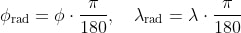
            2. Feet to Meter:
                - 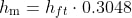
            3. ECEF convertion:
                - 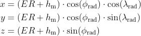
5. Store:
    - The unfiltered (and filtered) data will stored at ```./data./preprocessed``` with name ```readsb-hist_merged.csv``` (no filter region file was choose) and ```readsb-hist_filtered_by_{name of region filter file with no ".json"}.csv``` (with region filter file).
    - For instance, the first 5 rows of ```./data./preprocessed./readsb-hist_filtered_by_Taiwan_manual_edges.csv``` :
        ```csv
        year,month,day,hour,minute,second,hex,flight,t,alt_baro,alt_geom,gs,track,geom_rate,squawk,nav_qnh,nav_altitude_mcp,nav_altitude_fms,nav_heading,lat,lon,nic,rc,nic_baro,nac_p,nac_v,sil,sil_type,geohash,ecef_x,ecef_y,ecef_z
        2025,4,1,0,2,45,899046,CAL601,B738,1725,1950,169.9,47.39,1184,6264,1019.2,3008,3008,51.33,25.109067,121.26227,8,186,1,10,2,3,perhour,wsqnz6uqztq4,-2994112.9568203683,4931763.774640314,2703739.699255408
        2025,4,1,0,2,50,899046,CAL601,B738,1825,2075,177.0,47.75,1184,6264,1019.2,3008,3008,51.33,25.111767,121.265535,8,186,1,10,2,3,perhour,wsqnz7qyeu8t,-2994345.7634592457,4931513.723232558,2704027.7461128747
        2025,4,1,0,2,55,899046,CAL601,B738,1925,2150,184.1,48.08,1120,6264,1019.2,18592,18000,51.33,25.11442,121.268748,8,186,1,10,2,3,perhour,wsqnzecnnehq,-2994568.0573173896,4931256.46817952,2704304.58935681
        2025,4,1,0,3,0,899046,CAL601,B738,2050,2300,188.5,48.87,1120,6264,1019.2,20000,18000,51.33,25.117865,121.273049,8,186,1,10,2,3,perhour,wsqnzss64v7m,-2994875.2970717354,4930928.05980613,2704670.879634547
        2025,4,1,0,3,5,899046,CAL601,B738,2100,2325,193.1,50.04,1472,6264,1019.2,20000,20000,51.33,25.11882,121.274261,8,186,1,10,2,3,perhour,wsqnzstpxp7j,-2994959.7803176898,4930832.072570452,2704770.2738511804
        ```

## Stage 2: Data mining
### Goal
Cluster the aircrafts by position (GPS coordinates and geometric altitude) by different algorithms.
### Course requirements
- Must choose one data mining tool to use: [Weka](https://www.weka.io/) / [Orange](https://orangedatamining.com/download/) / [KNIME](https://www.knime.com/).
### Experiments
- Dataset: ```./data./preprocessed./readsb-hist_filtered_by_Taiwan_manual_edges.csv```
- Because the dataset is small, so finetuning minPoint is crucial.
- Used attributes:
    ```
    gs
    track
    squawk
    nav_heading
    ecef_x
    ecef_y
    ecef_z
    ```
- File naming
    - ```clustered.arff```: the output file after using Weka.
    - ```clustered.csv```: the output file after clustered, only has one column ```cluster```, ```-1``` means noise, else means the serial number of the cluster.
    - ```clustered.html```: the visualized map page that scatter each row in data, colored by the cluster number. The color of noise must be gray, else chosen randomly. The color will not repeat.
    - ```3D.png```: the 3D (```lat```, ```lon```, ```alt_geom```) visualized graph that colored by cluster number.
    - ```distribution.csv```: the distribution of the number of each cluster.
    - ```distribution.png```: the bar chart of ```distribution.csv```.
#### Clustering
1. Python
    - Run:
        ```
        python cluster.py
        ```
    - Methods:
        1. [K-Means](https://scikit-learn.org/stable/modules/generated/sklearn.cluster.KMeans.html)
            - I try the 3 combination ranges of ```min_clusters``` and ```max_clusters```:
                1. ```min_clusters``` = 2, ```max_clusters``` = 40
                2. ```min_clusters``` = 2, ```max_clusters``` = 125
                3. ```min_clusters``` = 7, ```max_clusters``` = 20
            - The hyperparameters settings:
                ```random_state``` = 0, ```n_init``` = 10
            - I run each ```k``` for ```k``` in [```min_clusters```, ```max_clusters```]
            - And use 2 methods to evaluate and store the clustering by best score of each methods:
                1. Elbow method - SSE (Sum of the Squared Errors), store the clustering with lowest SSE
                2. Silhouette analysis - Silhouette Score, store the clustering with the highest Silhouette Score
            - Results:
                1. ```min_clusters``` = 2, ```max_clusters``` = 40
                    - Evaluation
                        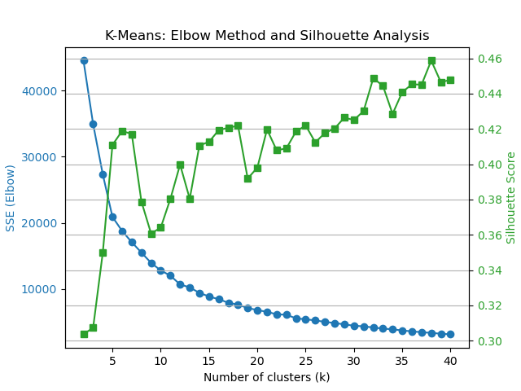
                    - SSE: 40 clusters (0 ~ 39)
                        
                        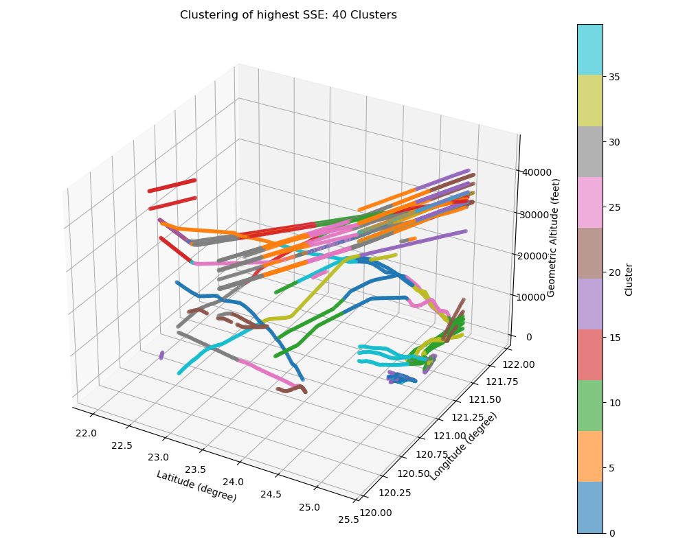
                    - Silhouette Score: 38 clusters (0 ~ 37)
                        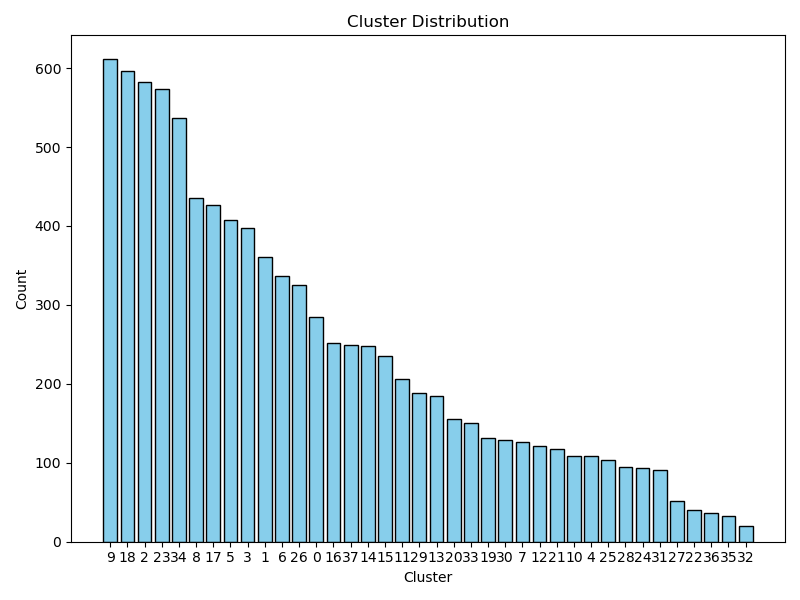
                        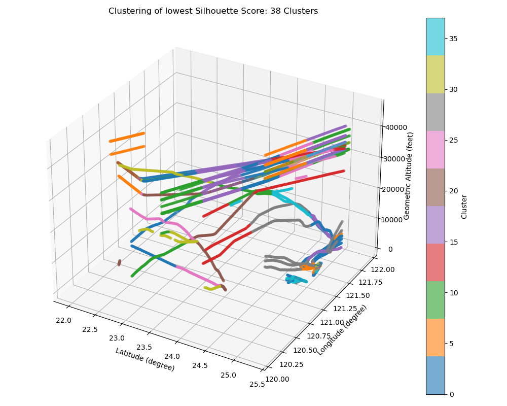
                2. ```min_clusters``` = 2, ```max_clusters``` = 125
                    - Evaluation
                        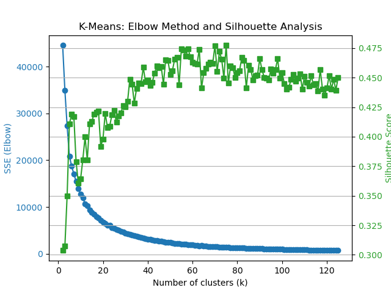
                    - SSE: 125 clusters (0 ~ 124)
                        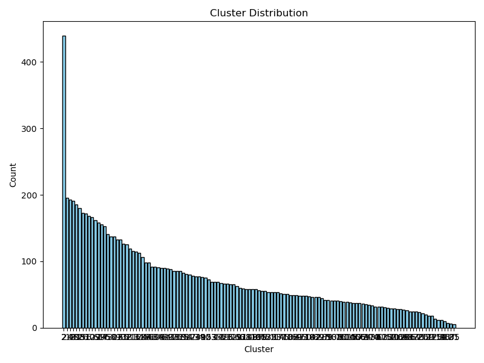
                        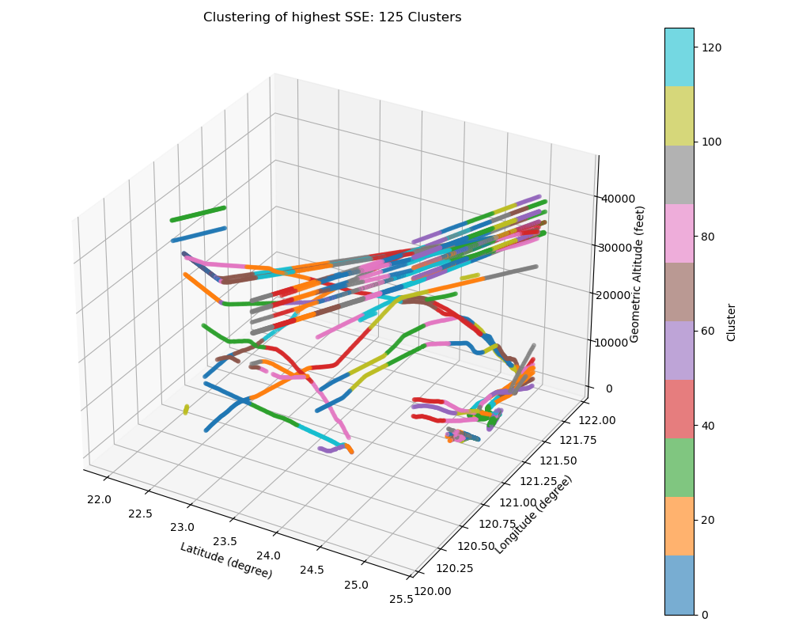
                    - Silhouette Score: 75 clusters (0 ~ 74)
                        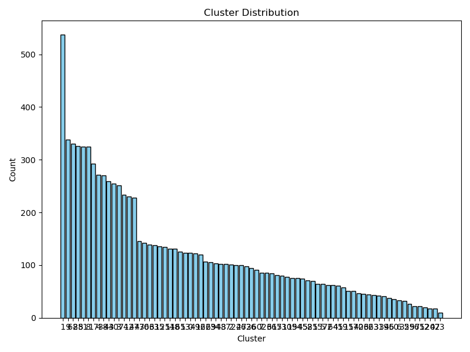
                        
                3. ```min_clusters``` = 7, ```max_clusters``` = 20
                    - Evaluation
                        
                    - SSE: 20 clusters (0 ~ 19)
                        
                        
                    - Silhouette Score: 18 clusters (0 ~ 17)
                        
                        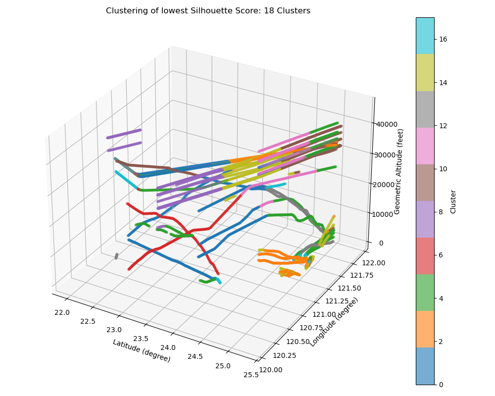
        2. [HDBSCAN](https://scikit-learn.org/stable/modules/generated/sklearn.cluster.HDBSCAN.html) and [OPTICS](https://scikit-learn.org/stable/modules/generated/sklearn.cluster.OPTICS.html)
            - Fine-tuned records and get the "ideal hyperparameters":
                1. The definition of the "ideal hyperparameters":
                    - Inputs and outputs
                        > **Function** `get_ideal_hyperparameters(records_df, data_num, noise_weight, min_points_weight, clusters_weight)`  
                        > &nbsp;&nbsp;&nbsp;&nbsp;**Input:**  
                        > &nbsp;&nbsp;&nbsp;&nbsp;&nbsp;&nbsp;&nbsp;&nbsp;- `records_df`: DataFrame containing clustering results  
                        > &nbsp;&nbsp;&nbsp;&nbsp;&nbsp;&nbsp;&nbsp;&nbsp;- `data_num`: total number of samples  
                        > &nbsp;&nbsp;&nbsp;&nbsp;&nbsp;&nbsp;&nbsp;&nbsp;- `noise_weight`: maximum allowed noise ratio (default: 7%)  
                        > &nbsp;&nbsp;&nbsp;&nbsp;&nbsp;&nbsp;&nbsp;&nbsp;- `min_points_weight`: maximum allowed min_points ratio (default: 5%)  
                        > &nbsp;&nbsp;&nbsp;&nbsp;&nbsp;&nbsp;&nbsp;&nbsp;- `clusters_weight`: minimum allowed cluster number ratio (default: 0.1%)  
                        > &nbsp;&nbsp;&nbsp;&nbsp;**Output:**  
                        > &nbsp;&nbsp;&nbsp;&nbsp;&nbsp;&nbsp;&nbsp;&nbsp;- `(ideal_min_points, ideal_epsilon)`
                    - Logic
                        > **let** `max_noise_num = data_num × noise_weight`  
                        > **let** `max_min_points = data_num × min_points_weight`  
                        > **let** `min_cluster_num = data_num × clusters_weight`  
                        >  
                        > **let** `ideal_df = { r ∈ records_df | r.noise_num ≤ max_noise_num ∧ r.min_points ≤ max_min_points ∧ r.clustering_num ≥ min_cluster_num }`  
                        >  
                        > **if** `ideal_df ≠ ∅`:  
                        > &nbsp;&nbsp;&nbsp;&nbsp;**let** `highest_density = first( sort(ideal_df, by = [↓ min_points, ↑ epsilon, ↑ noise_num] ))`  
                        >  
                        > **else**:  
                        > &nbsp;&nbsp;&nbsp;&nbsp;**let** `highest_density = first( sort(records_df, by = [↑ noise_num, ↓ min_points, ↑ epsilon] ))`  
                        >  
                        > **return** `(highest_density.min_points, highest_density.epsilon)`
                2. Test each combinations of the following:
                    - ```min_points``` = ```10, 20, 30, 40, 50, 60, 70, 80, 90, 100```
                    - ```epsilon``` = ```0.7, 0.8, 0.9, 1.0, 1.1, 1.2, 1.3, 1.4, 1.5, 1.6, 1.7, 1.8, 1.9, 2.0```
                3. Fine-tuned records:
                    - Fine-tuned records:
                        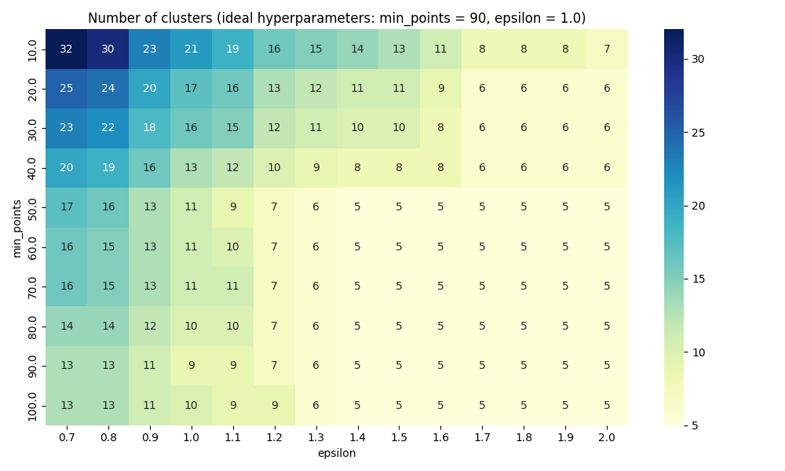
                        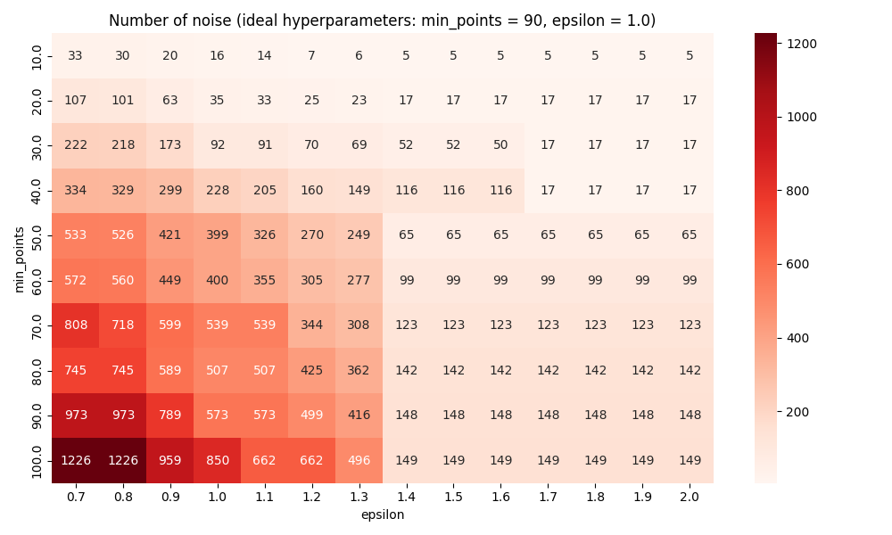
                    - OPTICS
                        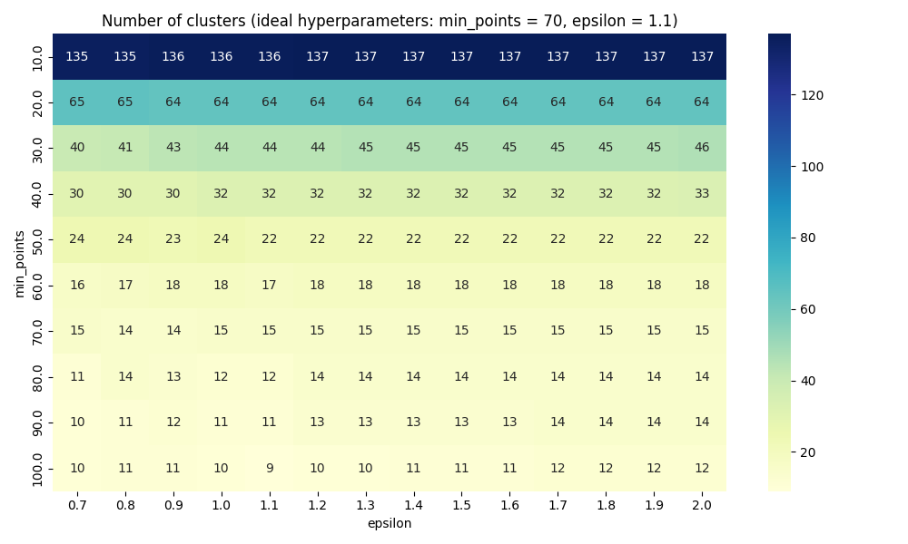
                        
            - After get the ideal hyperparameters of HDBSCAN and OPTICS, run the following combinations of each method:
                1. ```min_points``` = 7, ```epsilon``` = 0.07
                2. ```min_points``` = 7, ```epsilon``` = 0.1
                3. ```min_points``` = 20, ```epsilon``` = 0.07
                4. ```min_points``` = 20, ```epsilon``` = 0.1
                5. ```min_points``` = 20, ```epsilon``` = 0.6
                6. ```min_points``` = 70, ```epsilon``` = 1.1 (ideal hyperparameters of OPTICS)
                7. ```min_points``` = 90, ```epsilon``` = 1.0 (ideal hyperparameters of HDBSCAN)
            - Results:
                - HDBSCAN:
                    1. ```min_points``` = 7, ```epsilon``` = 0.07: 125 clusters (noise + 0 ~ 123)
                        
                        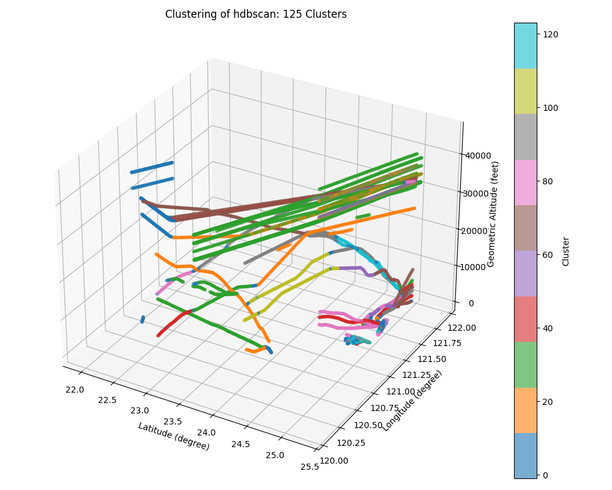
                    2. ```min_points``` = 7, ```epsilon``` = 0.1: 120 clusters (noise + 0 ~ 118)
                        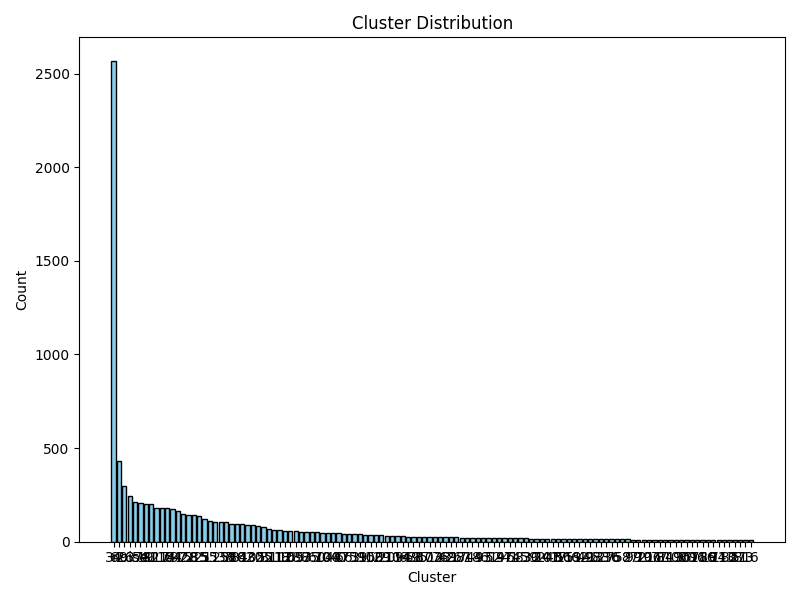
                        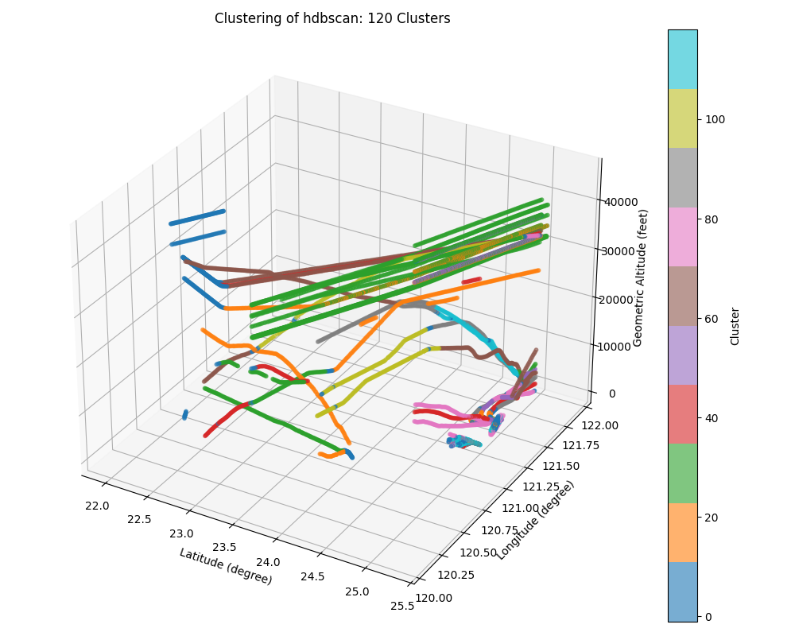
                    3. ```min_points``` = 20, ```epsilon``` = 0.07: 60 clusters (noise + 0 ~ 58)
                        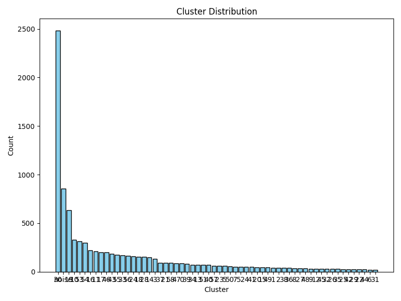
                        
                    4. ```min_points``` = 20, ```epsilon``` = 0.1: 60 clusters (noise + 0 ~ 58)
                        
                        
                    5. ```min_points``` = 20, ```epsilon``` = 0.6: 28 clusters (noise + 0 ~ 26)
                        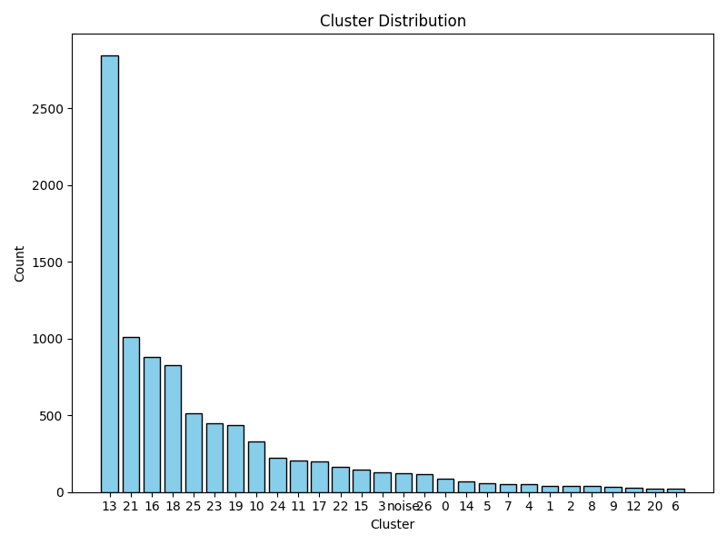
                        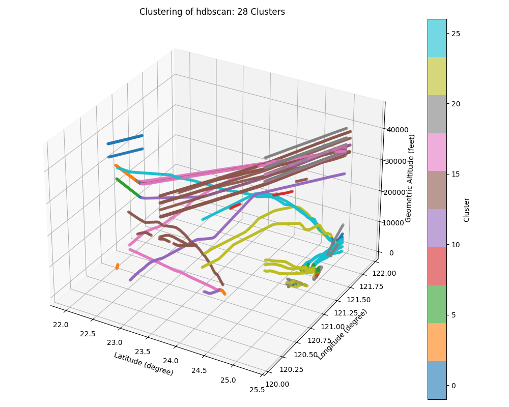
                    6.  Ideal hyperparameters of OPTICS: ```min_points``` = 70, ```epsilon``` = 1.1: 11 clusters (noise + 0 ~ 9)
                        
                        
                    7.  Ideal hyperparameters of HDBSCAN: ```min_points``` = 90, ```epsilon``` = 1.0: 9 clusters (noise + 0 ~ 7)
                        
                        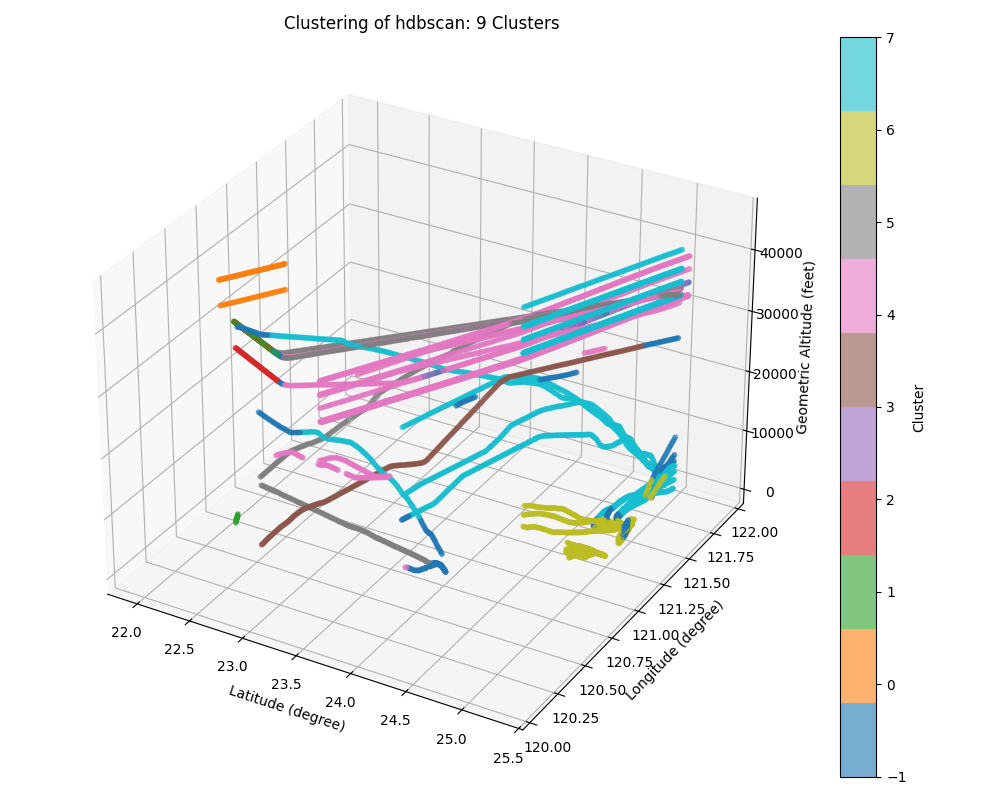
                - OPTICS:
                    1. ```min_points``` = 7, ```epsilon``` = 0.07: 125 clusters (noise + 0 ~ 123)
                        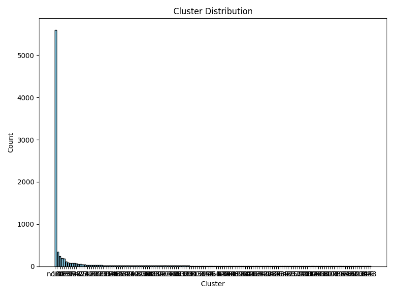
                        
                    2. ```min_points``` = 7, ```epsilon``` = 0.1: 120 clusters (noise + 0 ~ 118)
                        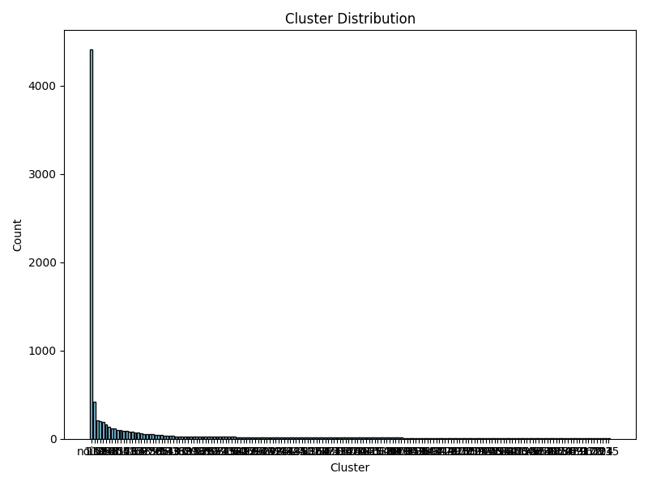
                        
                    3. ```min_points``` = 20, ```epsilon``` = 0.07: 60 clusters (noise + 0 ~ 58)
                        
                        
                    4. ```min_points``` = 20, ```epsilon``` = 0.1: 60 clusters (noise + 0 ~ 58)
                        
                        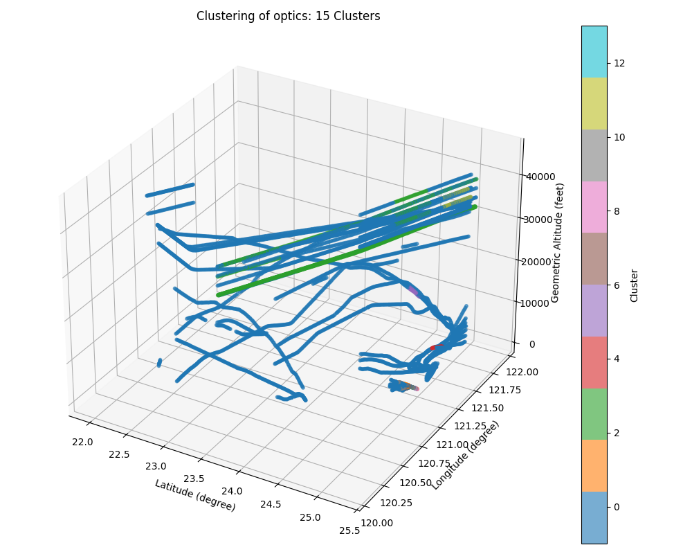
                    5. ```min_points``` = 20, ```epsilon``` = 0.6: 28 clusters (noise + 0 ~ 26)
                        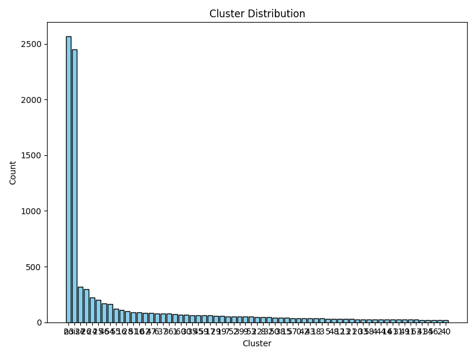
                        
                    6.  Ideal hyperparameters of OPTICS: ```min_points``` = 70, ```epsilon``` = 1.1: 11 clusters (noise + 0 ~ 9)
                        
                        
                    7.  Ideal hyperparameters of HDBSCAN: ```min_points``` = 90, ```epsilon``` = 1.0: 9 clusters (noise + 0 ~ 7)
                        
                        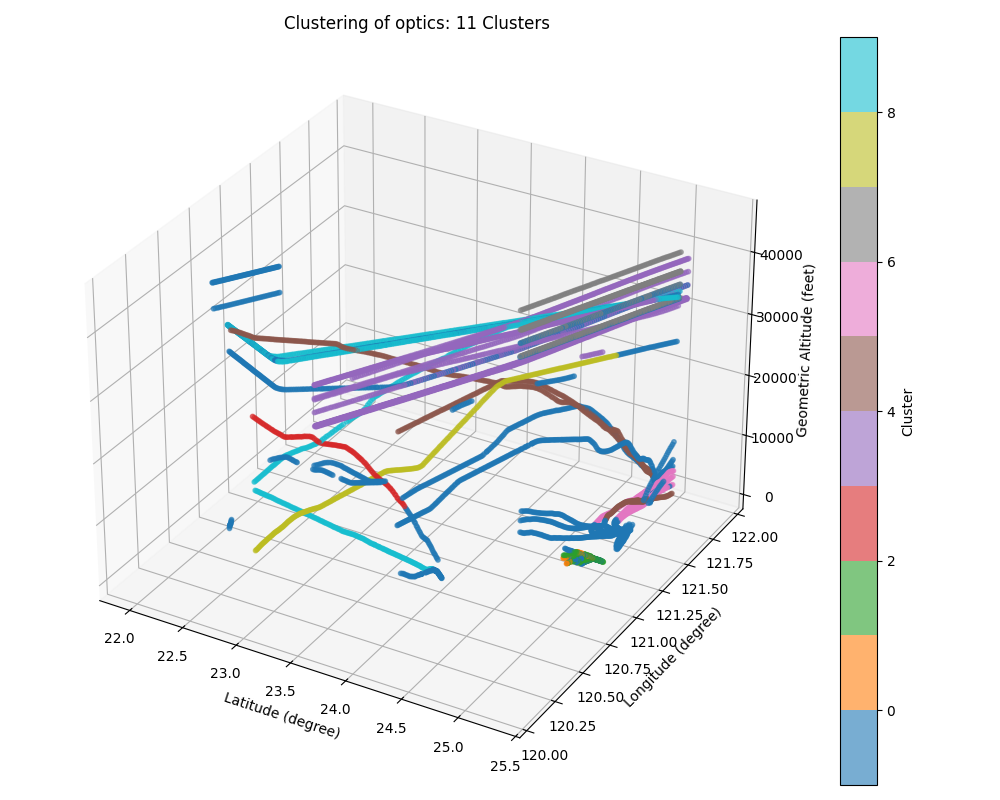
2. Weka
    - Run:
        - Download [Weka](https://www.weka.io/), set the hyperparameters as the following and run
        - Convert and visualize the outputs:
            ```
            python eval_end_draw_weka_results.py
            ```
    - Methods:
        1. [DBSCAN](https://weka.sourceforge.io/doc.stable/weka/clusterers/DBSCAN.html)
            - After fine-tuned manually, I choose 2 combinations of ```minPoints``` and ```epsilon```:
                1. ```minPoints``` = 7, ```epsilon``` = 0.07
                2. ```minPoints``` = 20, ```epsilon``` = 0.6
            - Other hyperparameters remain as the defaults
            - The result clustering will be legitimate in the following intervals:
                - 0.07 <= ```epsilon``` <= 0.6
                - 7 <= ```minPoints``` <= 20
            - So I run the following combinations:
                1. ```min_points``` = 7, ```epsilon``` = 0.07
                2. ```min_points``` = 7, ```epsilon``` = 0.1
                3. ```min_points``` = 20, ```epsilon``` = 0.07
                4. ```min_points``` = 20, ```epsilon``` = 0.1
                5. ```min_points``` = 20, ```epsilon``` = 0.6
                6. ```min_points``` = 70, ```epsilon``` = 1.1 (ideal hyperparameters of OPTICS)
                7. ```min_points``` = 90, ```epsilon``` = 1.0 (ideal hyperparameters of HDBSCAN)
            - Results:
                1. ```min_points``` = 7, ```epsilon``` = 0.07: 69 clusters (noise + 0 ~ 67)
                    
                    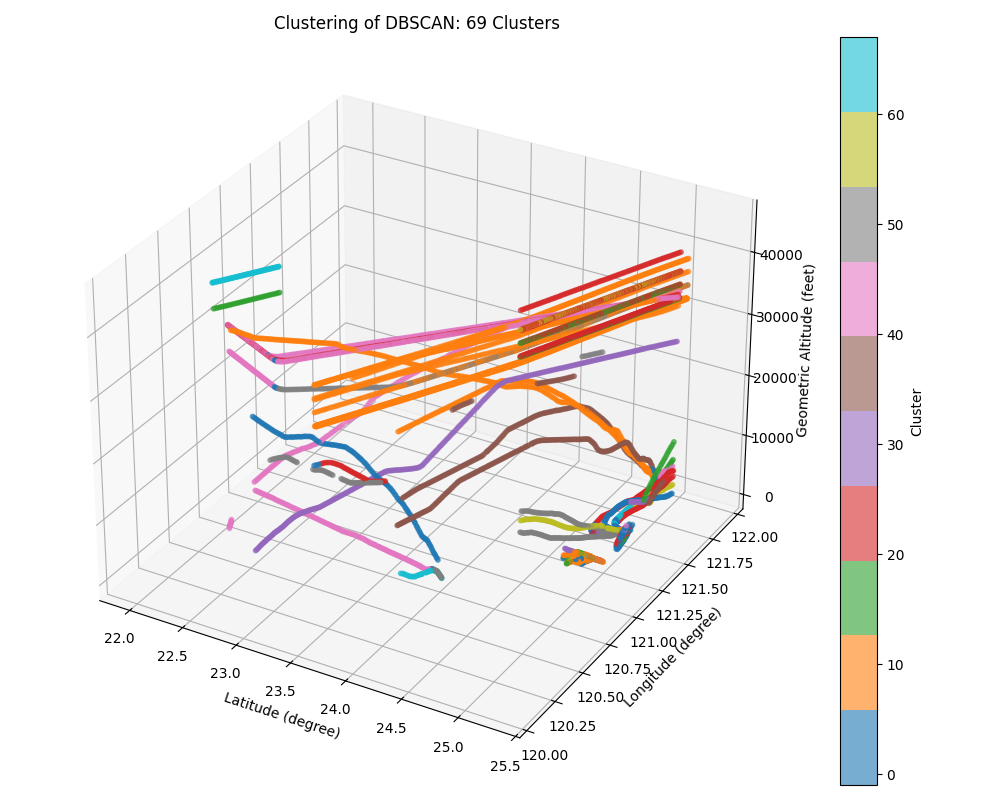
                2. ```min_points``` = 7, ```epsilon``` = 0.1: 42 clusters (noise + 0 ~ 40)
                    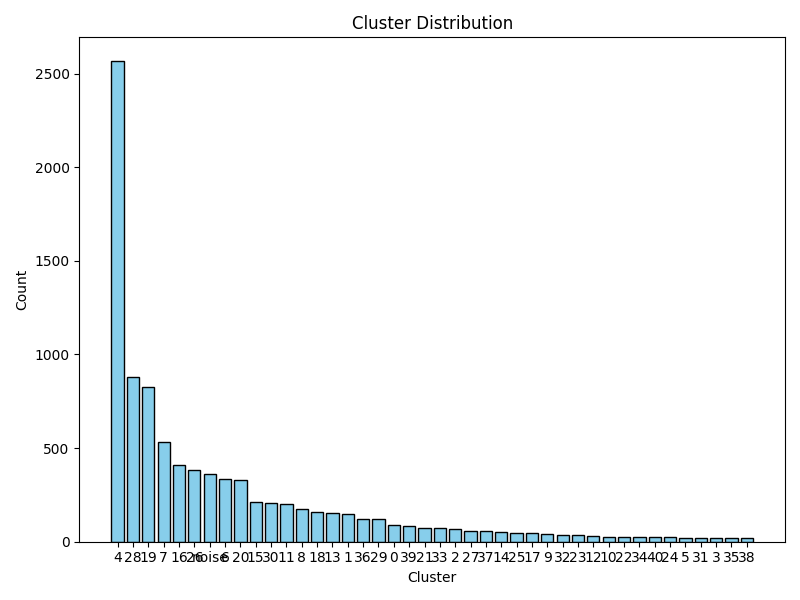
                    
                3. ```min_points``` = 20, ```epsilon``` = 0.07: 49 clusters (noise + 0 ~ 47)
                    
                    
                4. ```min_points``` = 20, ```epsilon``` = 0.1: 42 clusters (noise + 0 ~ 40)
                    
                    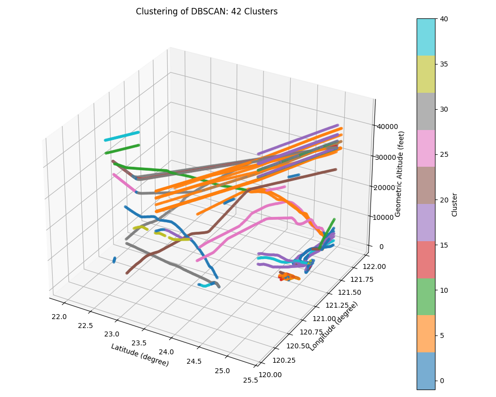
                5. ```min_points``` = 20, ```epsilon``` = 0.6: 2 clusters (noise + 0)
                    
                    
                6.  Ideal hyperparameters of OPTICS: ```min_points``` = 70, ```epsilon``` = 1.1: 1 cluster (0)
                    
                    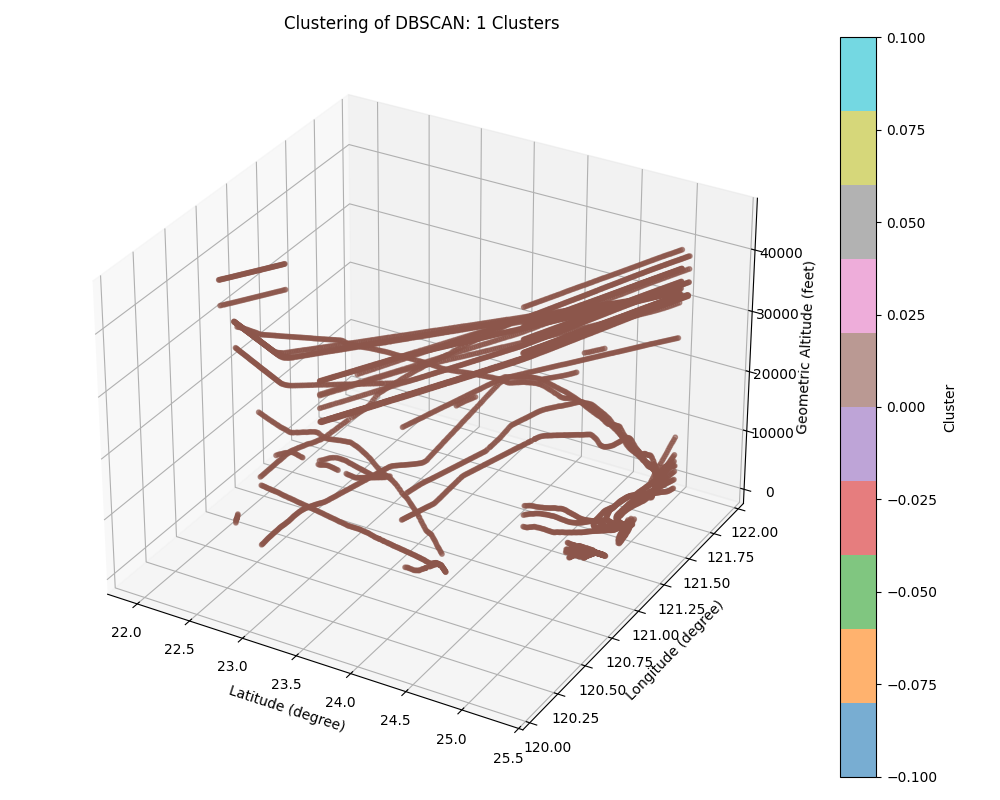
                7.  Ideal hyperparameters of HDBSCAN: ```min_points``` = 90, ```epsilon``` = 1.0: 1 cluster (0)
                    
                    
        2. [EM](https://weka.sourceforge.io/doc.dev/weka/clusterers/EM.html)
            - Based on the result of DBSCAN, I only try these 2 combinations:
                1. ```numClusters``` = 7
                2. ```numClusters``` = 20
                3. ```numClusters``` = 70
                4. ```numClusters``` = 90
            - Other hyperparameters settings:
                - ```maxIterations```: 500
                - ```seed```: 10
                - Other hyperparameters remain as the defaults
            - Results:
                1. ```numClusters``` = 7: 7 clusters (0 ~ 6)
                    
                    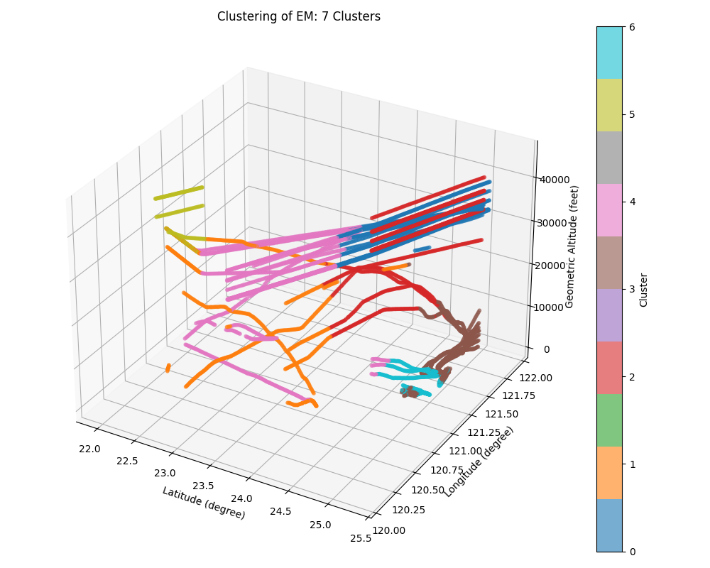
                2. ```numClusters``` = 20: 20 clusters (0 ~ 19)
                    
                    
                3. ```numClusters``` = 70: 70 clusters (0 ~ 69)
                    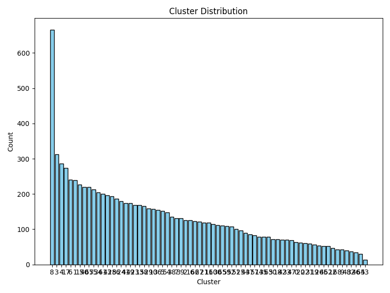
                    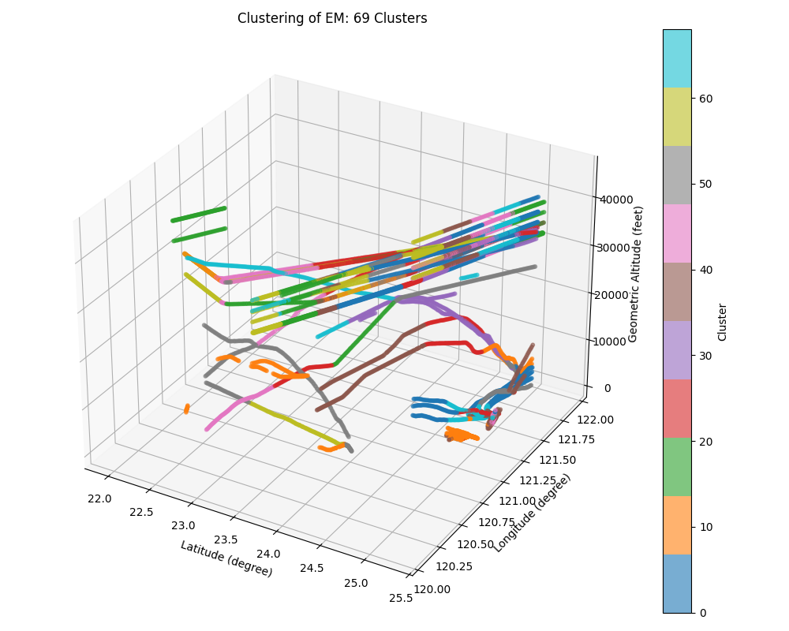
                4. ```numClusters``` = 90: 90 clusters (0 ~ 89)
                    
                    
        3. [XMeans](https://weka.sourceforge.io/doc.stable/weka/clusterers/XMeans.html)
            - Based on the previous results, I try the 3 combinations:
                1. ```minNumClusters``` = 7, ```maxNumClusters``` = 20
                1. ```minNumClusters``` = 20, ```maxNumClusters``` = 70
                1. ```minNumClusters``` = 70, ```maxNumClusters``` = 90
            - Other hyperparameters remain as the defaults
            - Results:
                1. ```minNumClusters``` = 7, ```maxNumClusters``` = 20: 13 clusters (0 ~ 12)
                    
                    
                2. ```minNumClusters``` = 20, ```maxNumClusters``` = 70: 37 clusters (0 ~ 36)
                    
                    
                3. ```minNumClusters``` = 70, ```maxNumClusters``` = 90: 90 clusters (0 ~ 89)
                    
                    
#### Analyzing
- Run:
    ```
    python analyzer.py
    ```
- Methods:
    - TODO
- Demo: interact with the ````clustered.html```` clustered data file
    - Demo file: [HDBSCAN with min_points = 7, epsilon = 0.07](./python_results/hdbscan/readsb-hist_filtered_by_Taiwan_manual_edges/min_7_epsilon_0_07/clustered.html)
        Image 1: the 3D visualization of Taiwan main island.
        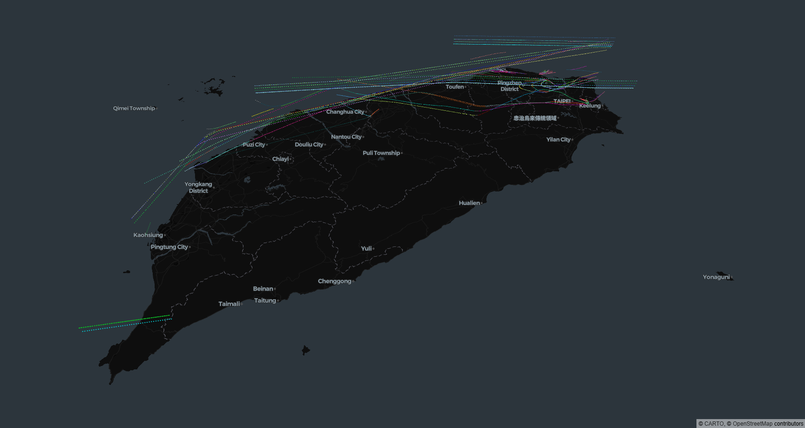
        Image 2: the current data point belongs to noise (cluster number = -1).
        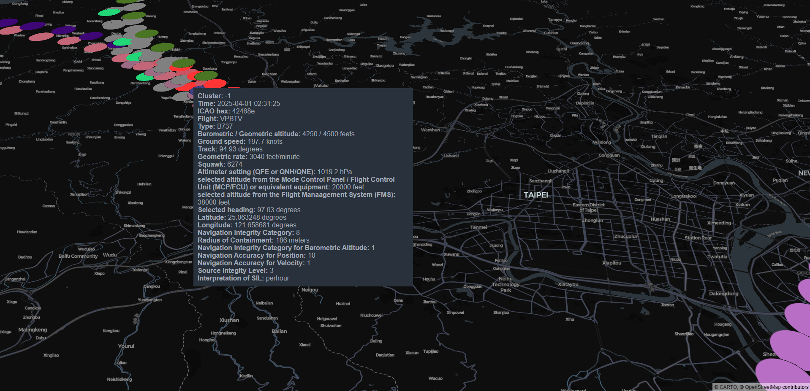
        Image 3: observed that the highest density is at northern airspace of Taiwan.
        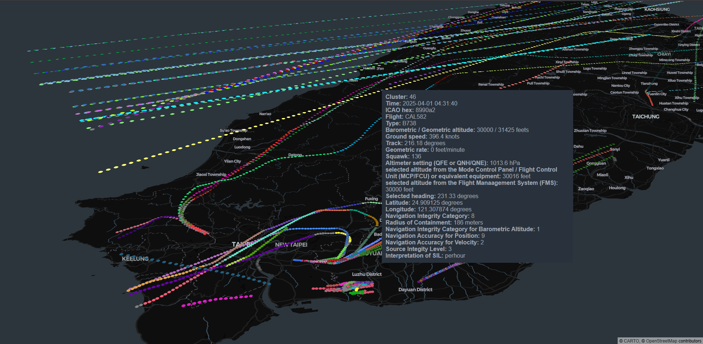
## Stage 3: Discord bot - Interactive system
- To be continued
-  Used scripts and folders: ```./bot.py```
- If you want to build you own bot:
    1. Create a discord bot, get a token at ```BOT``` pgae
    2. Create an ```.env``` file and store at the root folder, set ```DISCORD_BOT_TOKEN='<YOUR_DISCORD_BOT_TOKEN>'``` into it
- Still learning from [this tutorial](https://github.com/smallshawn95/Python-Discord-Bot-Course)

## adsb.lol api testing
### Before running
-  Used scripts: ```./adsb_lol_api.py```, ```./gps.py```, ```./main.py```
- Documentations please read [this official webpage](https://api.adsb.lol/docs)
### Run
```
python main.py
```